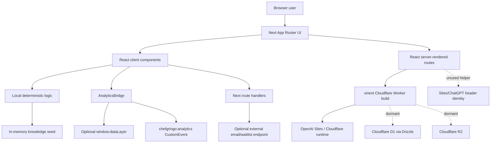
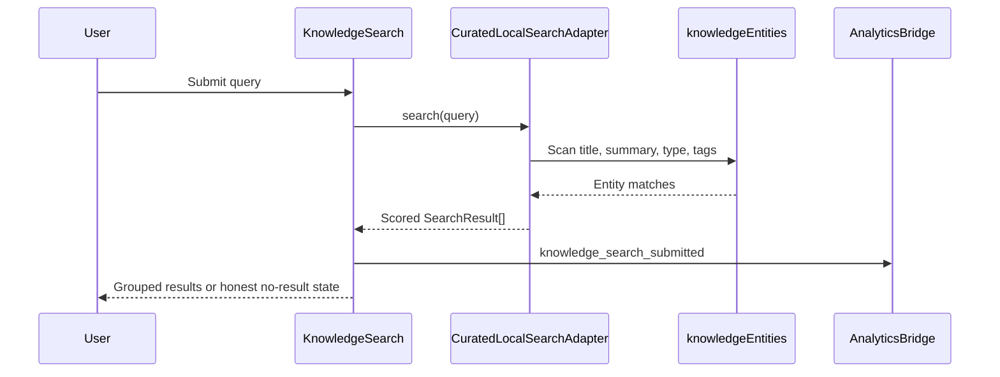
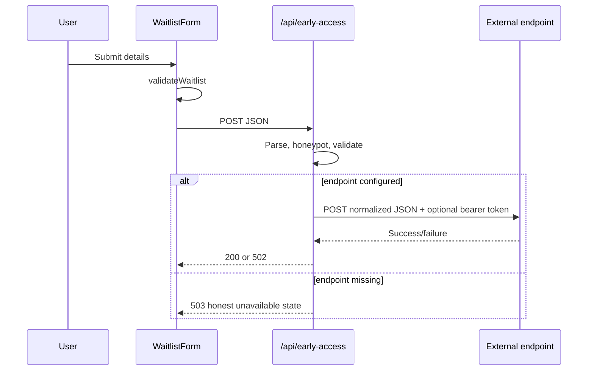

# Chef Gringo Engineering Handoff

**Status date:** 2026-08-05  
**Authoritative branch at handoff:** `codex/chef-gringo-foundation-sprint-01`  
**Authoritative commit before this handbook:** `c497a966ed3b4390b9c961267bb1fd9ac21c6f63`  
**Repository:** `jjflash0777-creator/chef-gringo-platform`  
**Purpose:** Living engineering handbook for the technical lead responsible for Chef Gringo.

**Permanent blueprint:** [`SYSTEM_ARCHITECTURE.md`](SYSTEM_ARCHITECTURE.md) — five-year technical architecture. This handbook covers current state, operations, and debt.

> This document distinguishes shipped behavior, local prototypes, dormant scaffolding, and product intent. Do not infer that a documented future capability exists in production.

---

## 1. Executive Summary

### Mission

Chef Gringo exists to help people learn, work, lead, and build businesses in hospitality through original, practical guidance grounded in operating experience. The project treats hospitality as a connected system: culinary craft, service, beverage, coffee, food safety, leadership, careers, operations, and entrepreneurship affect one another and should not be taught as isolated topics.

The central promise is **practical value before promotion**. Trust is a product requirement, not brand decoration. Chef Gringo should publish original work, label previews honestly, disclose commercial incentives, avoid invented authority, and preserve the distinction between educational guidance and professional, clinical, legal, regulatory, or financial judgment.

### Intended customers

The audience is intentionally broad but organized by context and progression rather than status:

- Home cooks who want reliable technique and adaptable food.
- Students and people entering hospitality.
- Front- and back-of-house practitioners developing craft or navigating careers.
- Supervisors, chefs, managers, culinary directors, and multi-site leaders.
- Food-truck, catering, café, restaurant, and other hospitality entrepreneurs.
- Senior-living and healthcare dining professionals.
- Hospitality educators.
- Eventually, responsible suppliers and vendors operating under explicit marketplace and affiliate governance.

The platform must respect people who want mastery without management as much as people pursuing leadership or ownership.

### Product vision

The long-term vision is a trusted hospitality operating system and career ecosystem. A user should be able to:

1. Understand a dish, ingredient, technique, role, or workflow.
2. Learn at an appropriate level: beginner, home/practitioner, or professional.
3. Apply deterministic tools for kitchen and operating decisions.
4. See how skills connect to roles, careers, leadership, and ownership.
5. Save progress and build learning paths.
6. Use carefully bounded AI over original, reviewed, source-grounded material.
7. Discover products, services, jobs, and peers without pay-to-win ranking.

The current Knowledge Engine prototype is the first concrete expression of that connected model. It demonstrates that Chef Gringo can move beyond a marketing site without prematurely adding accounts, AI providers, marketplaces, or a complex backend.

### Problem being solved

Hospitality knowledge is fragmented, unevenly taught, frequently stripped of operational context, and often monetized before it earns trust. Entry-level workers may not see a path forward. Operators often encounter motivational content or software theater instead of usable systems. Consumers and professionals cannot always distinguish independent recommendations from paid promotion. Specialized settings such as senior living add clinical and regulatory boundaries that generic recipe content ignores.

Chef Gringo addresses this by connecting:

- Concepts to practical decisions.
- Decisions to failure modes and consequences.
- Craft to careers and operating responsibility.
- Content to sources, review state, and limitations.
- Recommendations to transparent commercial governance.

### Current position

Chef Gringo is an early-stage, working web prototype:

- `main` contains the original MVP website.
- The current feature branch adds the public trust/platform foundation and the Hospitality Knowledge Engine prototype.
- The branch builds successfully and has 15 passing automated tests.
- The current application has public marketing, policy, founder, vision, early-access, legacy recipe/tool surfaces, `/discover`, and one deep Knowledge Page for Carbonara.
- Search and knowledge data are local and in memory.
- Email/waitlist APIs are provider-neutral adapters, but the tracked Sites project has no runtime environment variables configured; successful persistence is therefore not currently available through Sites.
- Database, storage, authentication, payments, semantic search, generative AI, accounts, commerce, and community are not implemented product capabilities.
- The tracked Sites project is the existing `Chef Gringo` project with custom/private access and a live deployment. Treat it as production unless the founder explicitly identifies a separate preview project ID.

This is the transition point from **validated product thesis and public trust layer** to **durable editorial and audience-learning infrastructure**.

---

## 2. Current State

### Completed features

#### Public platform foundation

- Responsive global header, navigation, footer, skip link, brand system, and shared visual tokens.
- Landing page positioning: “Build Your Future in Hospitality.”
- Mission and four-action framework: Learn, Work, Lead, Build.
- Audience/pathway previews, career ladder/branching model, operator-tool previews, founder story, and trust commitment.
- Dedicated Vision, Founder, Privacy, Terms, and Early Access pages.
- SEO metadata, Open Graph/Twitter metadata, `robots.txt`, and dynamic sitemap.
- Generated social image at `public/og-foundation.png`.

#### Early-access workflow

- Client-side `WaitlistForm` with required fields, validation, honeypot, status messaging, and analytics events.
- Server-side `/api/early-access` adapter.
- Provider-neutral endpoint and optional bearer token configuration.
- Honest `503` response when no provider is configured.
- Legacy `/api/subscribe` plus `NewsletterForm` retained for older newsletter/resource flows.

#### Hospitality Knowledge Engine prototype

- `/discover` searchable knowledge experience.
- Local lexical search with a small intent-expansion map.
- Grouping by entity type.
- Untouched, loading, no-result, and results states.
- Typed domain entities:
  - Dish
  - Recipe
  - Ingredient
  - Technique
  - Cuisine
  - Chef Interpretation
  - Equipment
  - Dietary Consideration
- Reserved future entity types:
  - Restaurant
  - Nutrition Topic
  - Supplier
  - Learning Path
  - Hospitality Role
  - Workflow
- Explicit typed relationships between entities.
- `/knowledge/dishes/carbonara` with:
  - Dish identity and context.
  - Honest historical/authenticity framing.
  - Beginner, Home Cook, and Professional guidance modes.
  - Original Chef Gringo recipe.
  - Deterministic serving scaler.
  - Production warning for larger quantities.
  - Locally generated shopping list.
  - Troubleshooting.
  - Attributed, original-language summaries of third-party interpretations.
  - Related ingredients, techniques, equipment, cuisine, and dietary context.
  - Curated local “Ask Chef Gringo” answers.
  - Trust and limitation disclosures.
- Provider-neutral TypeScript contracts for future repository, semantic search, grounded answers, commerce, places, nutrition, accounts/collections, and community contributions.

#### Legacy culinary content and tools

- Recipe index.
- Heart-conscious Big Mac–style burger makeover.
- Favorite-food makeover questionnaire and local result flow.
- Senior & Caregiver Kitchen landing page.
- Medical and nutrition disclaimer.
- Culinary Director Tools landing page.
- Deterministic general-purpose recipe scaler with unit-preserving math and printing.
- Newsletter/resource forms.

#### Quality controls

- ESLint using Next.js core-web-vitals and TypeScript presets.
- Strict TypeScript checking.
- Production vinext build.
- Node test suite covering:
  - General recipe scaling.
  - Knowledge entities and relationships.
  - Local search.
  - Carbonara scaling and shopping list grouping.
  - Third-party summary/copyright boundary.
  - Core route rendering and internal landing-page links.
  - Waitlist validation and honest unconfigured state.
  - Presence of analytics and responsive navigation behavior.

### Partially completed features

#### Early access and newsletters

The user experience and adapter endpoints exist. No actual provider is configured in the tracked Sites environment. The hosted environment-variable list is empty as of the status date. A successful response can only occur if a deployment environment outside the inspected Sites configuration injects a compatible endpoint.

Missing production work:

- Provider selection and configuration.
- Double opt-in decision.
- Abuse/rate limiting beyond a honeypot.
- Consent and retention policy.
- Export/deletion operations.
- Provider contract tests and observability.

#### Knowledge editorial system

The domain model, source fields, verification states, and review metadata exist. Content is hard-coded in TypeScript and there is no editorial UI, repository, version history, source-review workflow, or publishing gate.

Carbonara history is “source-ready,” not fully sourced and verified. Third-party interpretation source links are placeholders pending editorial verification.

#### Analytics

Events are emitted to:

- `window.dataLayer` if another script initializes it.
- A local browser `CustomEvent` named `chefgringo:analytics`.

There is no analytics vendor, consent manager, server collector, event schema registry, dashboard, or durable event storage configured.

#### Authentication

`app/chatgpt-auth.ts` contains safe helpers for Sites/ChatGPT header-based identity and sign-in/sign-out redirects. No current route calls these helpers. The site is not an account product.

The tracked Sites project itself uses custom access at the hosting layer. That access policy is deployment configuration, not application authentication.

#### Database and storage

Drizzle, D1 helpers, and migration packaging exist. `db/schema.ts` defines 26 tables across marketplace, knowledge-core, and revenue operations, with migrations in `drizzle/0000..0003`. `.openai/hosting.json` now has `"d1": "DB"`, so application persistence is active; `"r2": null`, so object storage is not.

### Placeholder features

- Landing-page hospitality pathway cards: visual previews and analytics only.
- Operator toolkit cards: marked “In development.”
- Senior/caregiver category cards: most guides say “Guides coming next.”
- Recipe shelf: intentionally sparse.
- Non-Big-Mac makeover requests: local “queue” messaging, not durable submissions.
- Search examples outside the seeded Carbonara graph: many deliberately return no results.
- Restaurant, retailer, price, map, ordering, affiliate, nutrition, account, collection, and community interfaces: contract definitions only.
- Payments and marketplace: architecture documents only.
- AI: product principles and adapter boundary only; no model call exists.

### Experimental features

- The entire Knowledge Engine should be treated as a product prototype.
- The local intent map in `app/knowledge/search/search.ts` is a discovery experiment, not a scalable search implementation.
- Curated local Q&A on the Carbonara page tests an AI-like interaction without a model provider.
- Guidance-mode switching tests whether one knowledge object can serve different levels of operating context.
- The favorite-food makeover form is an earlier local-only structured-input experiment.

### Known limitations

1. Knowledge breadth is extremely narrow; Carbonara is the only deep knowledge page.
2. Search is substring matching, has no stemming or typo handling, and can match low-information words.
3. Search data ships in the client bundle; it is not suitable for a large corpus.
4. No durable persistence exists.
5. No identity, saved state, personalization, or cross-device continuity exists.
6. No production email/waitlist integration is configured in Sites.
7. Analytics events are not delivered anywhere by default.
8. Historical sourcing is incomplete.
9. Third-party interpretation links are not finalized.
10. Nutrition values are intentionally absent where not verified.
11. Recipe scaling is mathematical only; it does not model yield loss, batch capacity, food safety, or production sequencing.
12. The legacy scaler and Carbonara scaler are separate implementations with different constraints and models.
13. Automated route tests do not explicitly enumerate every legacy route; the build confirms route compilation, while the internal-link test starts from the landing page only.
14. There is no browser end-to-end test suite committed to the repository.
15. There is no CI workflow.
16. There is no error monitoring, logging strategy, uptime monitoring, or product analytics dashboard.
17. Legal and policy pages are launch-stage drafts, not reviewed production terms.

---

## 3. Architecture

### System overview



### Framework and runtime

- **Application framework:** Next.js App Router APIs and conventions.
- **Rendering/build implementation:** `vinext`, which compiles the Next-style application through Vite for a Cloudflare Worker-compatible runtime.
- **UI:** React 19.
- **Language:** TypeScript with strict checking; a small amount of `.mjs` JavaScript supports direct Node tests.
- **Styling:** Global hand-written CSS in `app/globals.css`. Tailwind packages are installed, but the application does not use Tailwind utility classes.
- **Server runtime:** Cloudflare Worker entry point in `worker/index.ts`.
- **Package manager:** npm with committed `package-lock.json`.
- **Required Node version:** `>=22.13.0`.

### Deployment

The repository is configured for OpenAI Sites backed by Cloudflare-compatible output:

1. `npm run build` runs `vinext build`.
2. Vite loads `vinext()`, the local `sites()` packaging plugin, and `@cloudflare/vite-plugin`.
3. Application output goes to `dist/`.
4. `build/sites-vite-plugin.ts` copies:
   - `.openai/hosting.json` to `dist/.openai/hosting.json`
   - `drizzle/` to `dist/.openai/drizzle/`
5. `worker/index.ts` serves App Router requests and handles the vinext image-optimization endpoint.
6. A Sites version is saved from a validated, pushed commit and packaged build.
7. A saved version is deployed according to the Sites project access policy.

The tracked project:

- Title: `Chef Gringo`
- Slug: `chef-gringo-mvp`
- Project ID: tracked in `.openai/hosting.json`
- Access mode: custom/private to the founder at the time of audit
- Has an existing live deployment
- Has no hosted runtime environment variables configured

**Safety rule:** never assume this tracked project is a disposable preview. It has a live URL. Do not deploy a feature branch to it without explicit founder authorization. A separate preview project must be identified by its real Sites project ID, not by title alone.

### Vercel

There is no Vercel deployment configuration. `.vercel` is ignored, but no `vercel.json`, Vercel project metadata, or Vercel CI pipeline exists. The deployment architecture is Sites/Cloudflare, not Vercel.

If Vercel is considered later, treat it as an architecture decision requiring compatibility review; do not describe it as the current platform.

### Routing

App Router filesystem routes:

| Route | Status | Purpose |
| --- | --- | --- |
| `/` | Implemented | Platform landing page |
| `/about` | Implemented | Founder story |
| `/vision` | Implemented | Long-term platform vision |
| `/early-access` | Implemented, provider pending | Early-access form |
| `/privacy` | Implemented draft | Launch privacy notice |
| `/terms` | Implemented draft | Launch terms |
| `/discover` | Prototype | Local Knowledge Engine search |
| `/knowledge/dishes/carbonara` | Prototype | Complete Carbonara Knowledge Page |
| `/recipes` | Legacy implemented | Recipe index |
| `/favorite-food-makeovers` | Legacy experimental | Local makeover questionnaire |
| `/favorite-food-makeovers/big-mac-style-burger` | Legacy implemented | Complete makeover recipe |
| `/senior-caregiver-kitchen` | Legacy partial | Senior/caregiver category landing page |
| `/medical-and-nutrition-disclaimer` | Implemented | Educational safety boundary |
| `/culinary-director-tools` | Legacy partial | Tool index |
| `/tools/recipe-scaler` | Implemented | General deterministic recipe scaler |
| `/newsletter` | Implemented, provider pending | Newsletter signup |
| `/api/early-access` | Adapter | Early-access POST endpoint |
| `/api/subscribe` | Legacy adapter | Newsletter POST endpoint |
| `/robots.txt` | Implemented | Generated by `app/robots.ts` |
| `/sitemap.xml` | Implemented | Generated by `app/sitemap.ts` |

The primary navigation intentionally exposes Discover, Platform, Vision, Founder, and Early Access. Legacy culinary routes are not in the primary navigation and are reached through content links or direct URLs.

### Primary data flows

#### Knowledge search



#### Knowledge page interaction

- Server route renders `CarbonaraKnowledgePage`.
- Client state controls mode, servings, shopping-list visibility, and curated Q&A answer.
- `scaleRecipe` validates a whole-number serving count from 1–100 and scales quantities proportionally.
- `buildShoppingList` groups scaled ingredients locally.
- No request leaves the browser for knowledge, scaling, shopping, troubleshooting, or Q&A.

#### Early access



### APIs

#### `POST /api/early-access`

Input:

- `firstName`
- `email`
- `role`
- `interest`
- `companyWebsite` honeypot

Behavior:

- Invalid JSON → `400`.
- Honeypot populated → fake `200` without forwarding.
- Validation failure → `400`.
- No configured endpoint → `503`.
- Provider success → `200`.
- Provider/network failure → `502`.

The outgoing payload adds `source: "chef-gringo-foundation-sprint-01"`.

#### `POST /api/subscribe`

Input:

- `email`
- `source`

Behavior parallels the early-access adapter but has simpler validation and uses only the legacy email environment names.

Risks:

- No explicit request-size limit.
- No rate limiting.
- Endpoint configuration is trusted without an allowlist.
- No timeout/abort controller around provider fetch.
- No structured logging or provider response correlation.
- No durable idempotency.

### Environment variables

| Variable | Scope | Required | Purpose |
| --- | --- | --- | --- |
| `NEXT_PUBLIC_SITE_URL` | Public/build/runtime | Recommended | Canonical origin for metadata, sitemap, and robots |
| `EARLY_ACCESS_ENDPOINT` | Server only | For working waitlist | HTTPS endpoint receiving normalized waitlist JSON |
| `EARLY_ACCESS_TOKEN` | Server only, secret | Optional | Bearer token for the early-access endpoint |
| `EMAIL_SUBSCRIBE_ENDPOINT` | Server only | For working legacy newsletter; fallback for early access | Legacy email adapter endpoint |
| `EMAIL_SUBSCRIBE_TOKEN` | Server only, secret | Optional | Legacy bearer token; fallback for early access |
| `CODEX_SANDBOX` | Local tooling | No | Enables polling-based file watching in Codex Seatbelt |
| `WRANGLER_WRITE_LOGS` | Local/build tooling | No | Wrangler log behavior |
| `WRANGLER_LOG_PATH` | Local/build tooling | No | Project-local Wrangler log path |
| `MINIFLARE_REGISTRY_PATH` | Local tooling | No | Project-local Miniflare registry |

Rules:

- `.env*` is ignored except `.env.example`.
- Never place secret values in `.openai/hosting.json`.
- Sites runtime values must be managed through Sites environment configuration.
- As of the status date, the tracked Sites project has zero configured environment entries.

### Authentication

No application route requires a user account.

`app/chatgpt-auth.ts` is dormant infrastructure that:

- Reads trusted hosting-injected identity headers.
- Safely decodes a percent-encoded full name.
- Constructs sign-in/sign-out paths.
- Prevents open redirects by allowing only local relative return paths.

Do not build account features directly around hosting headers without first deciding:

- Whether Chef Gringo needs portable identity outside Sites.
- Account deletion/export requirements.
- Consent and profile schema.
- Authorization model.
- Separation between site access policy and end-user accounts.

### Database

- ORM: Drizzle.
- Intended database: Cloudflare D1/SQLite.
- Current schema: 26 tables in `db/schema.ts`, migrations `drizzle/0000..0003`.
- Current D1 binding: enabled (`d1: "DB"`).
- `db/index.ts` will throw if code requests `getDb()` without a `DB` binding.
- `examples/d1/` is a template, not application schema.

### Storage

- Intended object storage: Cloudflare R2.
- Current R2 binding: disabled (`r2: null`).
- No upload or media-management code exists.
- Public static assets live in `public/`.

### Email

There is no email SDK. The application forwards JSON to a configurable HTTPS endpoint. This keeps the application provider-neutral but shifts consent, deliverability, retry, unsubscribe, and retention responsibilities to an unspecified provider.

### Analytics

`trackEvent(name, details)`:

- Does nothing during server rendering.
- Pushes to `window.dataLayer` when present.
- Dispatches `chefgringo:analytics`.

Current events include landing views, CTA selections, waitlist states, newsletter/resource submissions, recipe/tool interactions, Knowledge Engine searches and result selections, guidance changes, serving changes, shopping-list generation, troubleshooting, related-entity selections, and curated questions.

No PII policy or schema enforcement exists at the event boundary. Some current events include free-form user values such as makeover food/goal or search query. Do not connect a third-party analytics vendor before a privacy review.

### Search

Current implementation:

- Local in-memory scan.
- Lowercased substring matching.
- Search fields: title, summary, entity type, tags.
- Small exact-query intent map.
- Exact-title boost.
- Entity-type grouping.

Intended evolution:

1. Repository-backed lexical search.
2. Semantic retrieval behind `SemanticSearchAdapter`.
3. Deduplication/reranking using stable entity IDs.
4. Grounded answers requiring entity IDs and source URLs.
5. Evaluation for retrieval quality, citation coverage, refusal, freshness, and mode fit.

### Integrations

Implemented:

- Optional generic early-access/email HTTP endpoint.
- Optional `window.dataLayer`.
- OpenAI Sites/Cloudflare hosting build.

Scaffolded but inactive:

- D1/Drizzle.
- R2 binding metadata.
- Sites/ChatGPT identity helpers.

Interface-only:

- Semantic search.
- Grounded AI answers.
- Commerce and retailer products.
- Restaurant/place discovery and maps.
- Nutrition analysis.
- Accounts and collections.
- Community contribution/moderation.

Documented only:

- Payments, subscriptions, wallets, marketplace payments, vendor payouts, refunds, disputes, and reconciliation.

---

## 4. Repository Tour

### Root

#### Critical files

- `package.json` — scripts, runtime version, dependencies.
- `package-lock.json` — reproducible npm dependency graph.
- `README.md` — basic setup; currently too foundation-specific and should link to this handbook.
- `.env.example` — supported application environment names with empty values.
- `.gitignore` — excludes dependencies, build output, local state, secrets, and environment files.
- `.openai/hosting.json` — opaque Sites project ID and logical D1/R2 bindings. Production-sensitive configuration.
- `vite.config.ts` — primary build/runtime integration.
- `next.config.ts` — effectively empty; present for Next compatibility.
- `tsconfig.json` — application TypeScript settings.
- `tsconfig.typecheck.json` — excludes generated/infrastructure surfaces from application type checking.
- `eslint.config.mjs` — Next/TypeScript lint configuration.
- `postcss.config.mjs` — PostCSS/Tailwind plugin configuration.
- `drizzle.config.ts` — migration generation configuration.

### `app/`

The App Router application root. Route folders map to URLs.

#### Global shell

- `app/layout.tsx` — global metadata, header/navigation, footer, analytics bridge.
- `app/page.tsx` — landing page.
- `app/globals.css` — entire design system and route styling. This is critical and increasingly difficult to maintain because legacy, foundation, and Knowledge Engine styles share one file.
- `app/robots.ts` and `app/sitemap.ts` — discoverability metadata.

#### `app/components/`

Cross-route components:

- `AnalyticsBridge.tsx` — provider-neutral browser event bridge.
- `WaitlistForm.tsx` — current foundation early-access form.
- `NewsletterForm.tsx` — legacy email form.
- `Notice.tsx` — reusable educational/safety notice.
- `PrintButton.tsx` — print action with optional event tracking.

#### `app/api/`

- `early-access/route.ts` — current foundation waitlist adapter.
- `subscribe/route.ts` — legacy email adapter.

These overlap and should eventually become one consent-aware subscription service with explicit list/source semantics.

#### `app/knowledge/`

The newest and most architecturally important product area.

- `domain/types.ts` — canonical entity and relationship types.
- `domain/seed.ts` — in-memory Carbonara graph and editorial content.
- `domain/recipe.ts` — deterministic scaling and shopping-list logic.
- `search/search.ts` — local adapter, search algorithm, grouping.
- `components/KnowledgeSearch.tsx` — `/discover` interaction.
- `components/KnowledgePage.tsx` — Carbonara experience.
- `dishes/carbonara/page.tsx` — route and metadata.
- `integrations/contracts.ts` — future provider-neutral boundaries.

Do not move provider SDK types into this domain layer.

#### Legacy product route folders

- `recipes/`
- `favorite-food-makeovers/`
- `senior-caregiver-kitchen/`
- `culinary-director-tools/`
- `tools/recipe-scaler/`
- `newsletter/`
- `medical-and-nutrition-disclaimer/`

These predate the platform foundation and Knowledge Engine. They remain useful prototypes and should be migrated deliberately rather than deleted or separately rebuilt.

#### `app/lib/`

- `waitlist.mjs` — shared interest options and deterministic form validation. `.mjs` allows direct Node test imports without a transpiler.

#### `app/chatgpt-auth.ts`

Dormant Sites authentication helper. It is security-sensitive even though unused; preserve its open-redirect defenses.

#### `app/_sites-preview/`

Currently empty. It is leftover starter structure and can be removed in a cleanup commit. Empty directories are not tracked by Git, so it is operational clutter rather than repository content.

### `build/`

- `sites-vite-plugin.ts` — build-only plugin that packages hosting metadata and Drizzle migrations into `dist/.openai`.

This folder name is excluded from application type checking and ESLint’s Next defaults. Changes need separate review because normal `npm run typecheck` does not cover it.

### `worker/`

- `index.ts` — Cloudflare Worker entry point and image optimization.

Also excluded from `tsconfig.typecheck.json`; runtime-specific types come from Cloudflare/vinext. Validate changes through the production build.

### `db/`

- `schema.ts` — intentionally empty application schema.
- `index.ts` — D1 Drizzle factory.

No product route currently imports `getDb()`.

### `drizzle/`

Generated migration metadata. `_journal.json` exists even though there are no migrations. Treat future SQL migrations as generated code: generate them from schema changes, inspect them, and commit intentionally.

### `examples/`

- `examples/d1/` — starter reference for a D1 notes API/schema.

It is not application code, is excluded from type checking, and should never be mistaken for a shipped endpoint or schema. Consider moving external starter examples to documentation or removing them once the real schema exists.

### `docs/foundation/`

Product constitution and governance:

- Mission/non-negotiables.
- Audience architecture.
- Brand and voice.
- Content standards.
- Product pillars.
- Affiliate ethics.
- Payment architecture.
- Roadmap.

These documents encode constraints that engineering must preserve.

### `docs/knowledge-engine/`

Knowledge product intent, entity/relationship architecture, editorial/source standards, and search evolution.

### `public/`

- `og-foundation.png` — active social card.
- `favicon.svg` — active site icon candidate served conventionally.
- `og.png`, `file.svg`, `globe.svg`, `window.svg` — likely starter/legacy assets; no application reference was found. Confirm access logs or generated HTML before deleting.

### `tests/`

- `scaler.test.mjs` — legacy deterministic scaler unit tests.
- `knowledge.test.mjs` — Knowledge Engine domain/search/scaling tests.
- `rendered-html.test.mjs` — imports the built Worker and exercises server-rendered routes/API states.

Important: `rendered-html.test.mjs` requires an up-to-date `dist/`, so run `npm run build` before `npm test`. The `test` script does not enforce this ordering itself.

### Generated and local-only directories

- `node_modules/` — dependencies.
- `dist/` — production build.
- `.next/`, `.vinext/`, `out/` — framework/build output.
- `.wrangler/` — local Wrangler/Miniflare state and logs.
- `coverage/`, `outputs/`, `work/` — ignored work products.

Never commit these.

### Dead and duplicated code assessment

Likely dead/starter artifacts:

- Empty `app/_sites-preview/`.
- Unreferenced `public/file.svg`, `public/globe.svg`, `public/window.svg`, and probably `public/og.png`.
- `examples/d1/` once a real schema is introduced.

Dormant but intentional:

- `app/chatgpt-auth.ts`.
- `db/index.ts` and empty schema.
- Integration contracts.

Duplicated concepts:

- `/api/early-access` and `/api/subscribe`.
- `WaitlistForm` and `NewsletterForm`.
- Legacy `scaler.mjs` and Knowledge Engine `domain/recipe.ts`.
- Legacy culinary pages and the newer knowledge entity/page system.

Do not remove dormant architecture merely because it is unused. Remove or consolidate only after deciding the target capability.

---

## 5. Branch Status

### `main`

- Head: `b32f155` — `Build Chef Gringo MVP`
- Remote: `origin/main`
- Purpose: original Chef Gringo MVP with recipes, caregiver content, favorite-food makeover, newsletter, and culinary tools.
- State: clean and synchronized with remote.
- Production relationship: assume this is the current production baseline unless release records prove otherwise.

### `codex/chef-gringo-foundation-sprint-01`

- Head: `c497a96` — `feat: add hospitality knowledge engine prototype`
- Remote: `origin/codex/chef-gringo-foundation-sprint-01`
- Ahead of `main`: 2 commits.
- Commit 1: `7b95e69` — platform foundation, public trust layer, early access, policies, architecture documentation.
- Commit 2: `c497a96` — Hospitality Knowledge Engine prototype.
- State: clean and synchronized with remote at the time of handoff audit.
- Merge topology: `main` is an ancestor, so the branch can currently be fast-forwarded; no textual merge conflict is expected.
- Validation: lint, TypeScript, build, and all 15 tests pass.

### Other active branches

No other local or remote-tracking branches were present at audit time.

### Merge readiness

Technically, the branch is mergeable and validated. Product/release readiness requires:

1. Founder review of the Foundation Sprint and Knowledge Engine UI.
2. Editorial review of Carbonara history and interpretation source records.
3. Confirmation that replacing the original landing experience is intended.
4. Decision whether the unconfigured early-access form is acceptable in production.
5. A private preview deployment to a separately identified preview project, or explicit authorization to deploy the tracked live project.
6. Legal review if launch-stage policy pages are presented as production policies.

### Recommended merge order

The two commits are stacked and should be reviewed in order:

1. `7b95e69` foundation.
2. `c497a96` Knowledge Engine.

Recommended release approach:

- Preview and review the entire branch together because Knowledge Engine navigation depends on the foundation shell.
- Merge by fast-forward or a PR preserving the two logical commits if review history matters.
- Do not cherry-pick Knowledge Engine alone onto the old MVP without reconciling layout, styles, sitemap, tests, and TypeScript configuration.

### Branch risks

- The branch substantially replaces the original landing-page presentation.
- The Knowledge Engine is polished enough to look more complete than its narrow dataset; labeling must remain visible.
- A live Sites project exists, but a verified separate private-preview project is not tracked.
- No CI protects the merge.
- Tests rely on build ordering that is not encoded in `npm test`.

---

## 6. Technical Debt

### Critical

#### 1. No CI/CD protection

There is no GitHub Actions or equivalent workflow. A merge can occur without lint, typecheck, build, or tests.

**Recommendation:** add a required CI workflow running install, lint, typecheck, build, and tests in the correct order.

#### 2. Deployment target ambiguity

The tracked Sites project has a live deployment and custom access. Historical attempts to use a placeholder preview ID created confusion. Project titles are not sufficient identifiers.

**Recommendation:** provision and persist a real separate preview project ID or formalize a version/promotion model with explicit production approvals.

#### 3. No durable early-access persistence

The principal conversion form fails honestly but cannot succeed in the current Sites environment.

**Recommendation:** make durable early access the next production capability, including consent and operational controls.

### High

#### 4. Hard-coded knowledge repository

All entities and editorial content are in one TypeScript seed file. This cannot support workflow, versioning, multiple editors, or corpus growth.

**Recommendation:** design a repository abstraction and editorial schema before adding many more dishes.

#### 5. Incomplete editorial sourcing

The model supports sources, but Carbonara history and chef-interpretation links remain pending.

**Recommendation:** establish source-review gates and do not upgrade content to `verified` automatically.

#### 6. Global CSS monolith

All old and new styles share `app/globals.css`. Selector collisions and regression risk will increase.

**Recommendation:** retain global tokens/base styles, then introduce route/component CSS modules or another agreed modular strategy.

#### 7. Build-dependent test command

`npm test` can test stale `dist` output if the developer forgets to build first.

**Recommendation:** add `test:unit`, `test:rendered`, and `validate`; make rendered tests build or verify commit freshness.

#### 8. Infrastructure excluded from typecheck

`build/`, `worker/`, `db/`, and `examples/` are excluded. Build catches some issues, but not all.

**Recommendation:** add an infrastructure-specific TypeScript configuration.

### Medium

#### 9. Duplicated email/waitlist surfaces

Two forms and two route handlers differ in payload, validation, events, and environment names.

**Recommendation:** consolidate behind one subscription domain service with list/source metadata.

#### 10. Duplicated scaling engines

The legacy scaler supports arbitrary decimal yields and units; the Knowledge Engine scaler supports typed metric ingredients and integer servings. The duplication is understandable but undocumented at the code boundary.

**Recommendation:** keep separate UI/domain models but extract shared ratio/rounding primitives after requirements are defined.

#### 11. Primitive search relevance

Substring matching can overmatch and has a hand-authored exact intent map.

**Recommendation:** add token normalization, stop words, field weights, and query tests before introducing semantic search.

#### 12. No event contract

Analytics names and payloads are ad hoc. Free-form query and makeover data may become privacy liabilities.

**Recommendation:** create typed event definitions and data-minimization rules before attaching a vendor.

#### 13. No error/observability platform

Provider failures collapse to generic messages. There are no correlation IDs, structured logs, or alerts.

**Recommendation:** add privacy-safe operational telemetry with the first real external provider.

#### 14. Route discoverability split

Legacy useful tools are not represented in primary navigation or the explicit sitemap array.

**Recommendation:** decide whether legacy routes are product surfaces to retain, migrate into Discover, or retire.

#### 15. Authentication scaffold may be mistaken for product auth

The helper is robust but unused.

**Recommendation:** add an explicit comment/reference in the README and architecture decision record before account work.

### Low

#### 16. Starter assets and empty folder

Unreferenced assets and `app/_sites-preview/` add noise.

#### 17. Formatting consistency

Some older pages are compressed into one-line JSX while newer code is more structured. No formatter script is configured.

**Recommendation:** adopt Prettier or a documented formatter and apply it in a controlled, isolated commit.

#### 18. README drift

The README describes Foundation Sprint 01 but not the Knowledge Engine or this handbook.

#### 19. Tailwind dependency without Tailwind usage

Tailwind and PostCSS packages remain installed despite hand-written CSS.

**Recommendation:** either commit to Tailwind or remove unused dependencies after verifying the vinext starter does not require them.

---

## 7. Product Roadmap

The roadmap below prioritizes trust, learning, and durable foundations over feature breadth.

### Immediate: next 1–2 weeks

1. **Private preview and founder acceptance**
   - Validate the complete feature branch in a distinct preview project.
   - Matters because product, copy, and trust boundaries need founder approval before infrastructure expansion.
2. **CI and release guardrails**
   - Add required validation and documented promotion steps.
   - Matters because the project now has production-sensitive configuration and multiple runtime layers.
3. **Durable early access**
   - Connect one provider end to end with consent, abuse control, and deletion/export process.
   - Matters because early audience learning is the highest-value near-term feedback loop.
4. **Editorial source completion for Carbonara**
   - Verify claims and authorized links.
   - Matters because the Knowledge Engine’s differentiation is trust.
5. **Audience interviews and taxonomy validation**
   - Use early-access interest data and founder interviews to choose the next knowledge cluster.
   - Matters because broad platform ambition must be narrowed by evidence.

### 30 days

1. Establish a lightweight versioned editorial repository and workflow.
2. Create 3–5 additional connected Knowledge Pages in one coherent cluster rather than unrelated dishes.
3. Improve lexical search relevance, tests, and no-result guidance.
4. Define typed analytics events and connect a privacy-appropriate analytics service.
5. Consolidate waitlist/newsletter domain logic.
6. Add accessibility and browser end-to-end testing for key flows.
7. Decide the canonical relationship between legacy culinary pages and Knowledge Engine entities.

**Why this matters:** one excellent content cluster proves reuse, relationships, editorial throughput, and returning-user value better than dozens of disconnected pages.

### 90 days

1. Introduce accounts only if research validates saved knowledge, collections, or learning progress.
2. Implement saved collections and recently viewed entities.
3. Ship one complete learning path connected to knowledge entities and techniques.
4. Add a real content review/publishing state machine.
5. Add repository-backed search and a measured hybrid-search experiment.
6. Build one operator tool family tied to knowledge/workflow entities.
7. Establish error monitoring, operational dashboards, backup/export, and incident procedures.

**Why this matters:** the platform becomes a repeat-use product instead of a set of pages.

### 6 months

1. Expand to multiple knowledge clusters: culinary technique, coffee/espresso, service, leadership, and one specialized operational domain.
2. Add retrieval-grounded assistance over reviewed Chef Gringo content with citations and refusal behavior.
3. Add structured progress and competency records.
4. Pilot Chef Gringo Pro with advanced tools/templates for a narrow professional audience.
5. Test carefully governed affiliate recommendations in one category.
6. Add organization/team concepts only if professional pilots need them.
7. Formalize content maintenance, review dates, correction process, and source audits.

**Why this matters:** this is the first plausible subscription and professional-value inflection point.

### 1 year

1. Offer a mature free knowledge layer plus paid individual/pro tiers.
2. Operate multiple reviewed learning paths and tool families.
3. Provide personalized, source-grounded discovery based on explicit user preferences.
4. Launch a governed supplier/equipment discovery layer if editorial operations can protect ranking integrity.
5. Pilot jobs, mentorship, or community only with moderation and safety capacity.
6. Evaluate marketplace transactions only after legal, tax, payments, refunds, vendor onboarding, and dispute operations are ready.
7. Build institutional partnerships with educators or operators without compromising editorial independence.

**Why this matters:** the long-term advantage is a trusted graph of knowledge, learning, careers, tools, and responsible commercial relationships—not a generic content site.

---

## 8. User Experience

### Ideal journey

#### 1. Arrival

A user lands through search, recommendation, social sharing, or direct brand awareness. The page immediately explains:

- Who Chef Gringo serves.
- What practical value is available now.
- Which features are previews.
- Why the guidance should be trusted.

#### 2. First useful action

The user searches for a dish, technique, role, workflow, or question. Results provide a useful answer even before signup.

For Carbonara:

- The user sees what the dish is.
- Chooses appropriate guidance.
- Understands heat-control techniques.
- Scales the recipe.
- Generates a shopping list.
- Troubleshoots failure.
- Follows connections to ingredients and methods.

#### 3. Context and progression

The product suggests the next useful action based on the knowledge object:

- Learn a technique.
- Practice a related dish.
- Understand professional production implications.
- Explore a role or workflow.
- Save to a collection or learning path.

#### 4. Trust-building conversion

After receiving value, the user joins early access or creates an account for a clear reason:

- Save progress.
- Receive a specific guide.
- Join a relevant pilot.
- Follow a knowledge cluster.

Do not gate basic trust-building content before value is demonstrated.

#### 5. Return

A returning user sees:

- Saved entities and collections.
- Recently viewed topics.
- Review/freshness updates.
- Progress in a learning path.
- New connected material relevant to stated interests.

#### 6. Loyalty

The user trusts Chef Gringo as the place that:

- Explains rather than performs expertise.
- Respects all hospitality roles.
- Helps them make real decisions.
- Discloses limits and incentives.
- Connects today’s task to tomorrow’s opportunity.

### Current UX gaps

- The landing page does not foreground the now-usable Knowledge Engine strongly enough.
- Legacy recipes/tools are difficult to discover from primary navigation.
- Search breadth does not match the breadth implied by example queries.
- Related entity links often loop back into Discover because individual entity pages do not exist.
- No breadcrumbs or global discovery state persists between search and knowledge pages.
- No saved state or return-user experience.
- No successful early-access path in the current Sites environment.
- No content freshness date visible to users.
- Verification language is present but not fully explained.
- No correction/report-content mechanism.
- Mobile behavior was manually validated but is not protected by automated browser tests.
- The dense Carbonara page could benefit from progress/navigation affordances and a print-focused recipe mode.

---

## 9. Business Model

### Principles

Revenue must fund better education, tools, research, and support without buying editorial outcomes. Recommendations must start with user fit, quality, reliability, support, and total cost. Commercial status is not a ranking signal.

### Likely model

#### Free layer

- Public knowledge pages.
- Foundational search/discovery.
- Selected recipes and tools.
- Career and role orientation.
- Trust-building editorial content.

Purpose: acquisition, mission delivery, and evidence of quality.

#### Individual subscription

Potential features:

- Saved collections and progress.
- Structured learning paths.
- Assessments and original resources.
- Advanced calculators and planning tools.
- Source-grounded assistance.
- Personalized recommendations based on explicit preferences.

#### Chef Gringo Pro

Potential professional features:

- Production and cost tools.
- Templates and operating systems.
- Team training workflows.
- Advanced leadership/operations learning.
- Organization-level collections and assignments.
- Exportable reports.

#### Affiliate strategy

Potential categories:

- Equipment.
- Books and education.
- Ingredients and suppliers.
- Software/services.

Requirements:

- Clear nearby disclosure.
- Documented evaluation criteria.
- No commission-based ranking.
- Separate sponsored placement.
- Audit trail for ranking changes.
- Ability to criticize or omit commercial partners.

The current code has no affiliate links or commerce integration.

#### Marketplace/service revenue

Longer-term opportunities:

- Supplier/vendor services.
- Marketplace commissions.
- Job listings or recruiting services.
- Professional education partnerships.
- Team/institution licenses.
- Events and workshops.
- Original templates/curricula.
- Advisory services.

Do not launch marketplace payments before vendor governance, legal entity/tax review, identity verification, disputes, refunds, and reconciliation are operational.

#### Advertising

Generic programmatic advertising is not part of the documented strategy and would likely damage trust. Prefer direct, disclosed, governed relationships if sponsorship is ever used.

---

## 10. Database Plan

### Current implementation

- Drizzle is installed.
- D1 configuration and migration packaging exist.
- The application schema defines 26 tables (`db/schema.ts`).
- A D1 database is bound as `DB`.
- Marketplace workflow, knowledge-core, and commercial-event routes read and write persistent records.

### Proposed bounded-context schema

Do not create all tables at once. Implement only the domain required by the next validated capability.

#### Identity and consent

##### `users`

- `id`
- `external_identity_provider`
- `external_subject`
- `email`
- `display_name`
- `status`
- `created_at`
- `updated_at`
- `deleted_at`

##### `user_consents`

- `id`
- `user_id` nullable for pre-account contacts
- `email`
- `consent_type`
- `policy_version`
- `granted_at`
- `withdrawn_at`
- `source`

##### `early_access_contacts`

- `id`
- `email_normalized`
- `first_name`
- `role`
- `primary_interest`
- `source`
- `provider_contact_id`
- `status`
- `created_at`
- `updated_at`

Never store raw bearer tokens or provider secrets.

#### Knowledge and editorial

##### `knowledge_entities`

- `id` stable domain ID
- `slug`
- `entity_type`
- `status`
- `verification_state`
- `current_revision_id`
- `created_at`
- `updated_at`
- `published_at`

##### `knowledge_entity_revisions`

- `id`
- `entity_id`
- `revision_number`
- `title`
- `summary`
- `body_json`
- `author_id`
- `change_note`
- `created_at`

Use validated JSON for type-specific fields initially, or normalized type tables when query requirements justify them.

##### `knowledge_relationships`

- `id`
- `from_entity_id`
- `to_entity_id`
- `relationship_type`
- `note`
- `status`
- `created_at`
- `updated_at`

Unique constraint on the meaningful edge identity.

##### `sources`

- `id`
- `canonical_url`
- `publisher`
- `title`
- `accessed_at`
- `rights_note`
- `created_at`

##### `entity_source_claims`

- `id`
- `entity_revision_id`
- `source_id`
- `claim_key` or anchored section reference
- `support_note`
- `verification_status`
- `reviewer_id`
- `reviewed_at`

##### `editorial_reviews`

- `id`
- `entity_revision_id`
- `review_type`
- `reviewer_id`
- `decision`
- `notes`
- `created_at`

#### Recipe-specific structured data

##### `recipes`

- `entity_id`
- `dish_entity_id`
- `author`
- `base_yield`
- `yield_unit`

##### `recipe_ingredients`

- `id`
- `recipe_entity_id`
- `ingredient_entity_id`
- `position`
- `quantity`
- `unit`
- `display_text`
- `group_name`
- `scale_note`

##### `recipe_steps`

- `id`
- `recipe_entity_id`
- `position`
- `title`
- `instruction`
- `minutes`
- `critical_control`

#### User value

##### `collections`

- `id`
- `user_id`
- `name`
- `visibility`
- `created_at`
- `updated_at`

##### `collection_items`

- `collection_id`
- `entity_id`
- `position`
- `note`
- `created_at`

##### `learning_paths`

- `id`
- `knowledge_entity_id`
- `status`
- `version`

##### `learning_path_items`

- `learning_path_id`
- `entity_id`
- `position`
- `required`

##### `user_learning_progress`

- `user_id`
- `learning_path_id`
- `entity_id`
- `status`
- `started_at`
- `completed_at`
- `evidence_json`

#### Community, only after moderation readiness

- `community_contributions`
- `moderation_cases`
- `moderation_actions`
- `reports`

Every public contribution requires lifecycle and audit fields.

#### Commerce, only after governance readiness

- `products`
- `merchants`
- `offers`
- `offer_price_snapshots`
- `affiliate_relationships`
- `recommendation_evaluations`

Keep editorial evaluation separate from offer/commission data.

### Relationships

```mermaid
erDiagram
    USERS ||--o{ COLLECTIONS : owns
    COLLECTIONS ||--o{ COLLECTION_ITEMS : contains
    KNOWLEDGE_ENTITIES ||--o{ COLLECTION_ITEMS : saved_as
    KNOWLEDGE_ENTITIES ||--o{ KNOWLEDGE_ENTITY_REVISIONS : versions
    KNOWLEDGE_ENTITY_REVISIONS ||--o{ ENTITY_SOURCE_CLAIMS : supports
    SOURCES ||--o{ ENTITY_SOURCE_CLAIMS : cited_by
    KNOWLEDGE_ENTITY_REVISIONS ||--o{ EDITORIAL_REVIEWS : reviewed_by
    KNOWLEDGE_ENTITIES ||--o{ KNOWLEDGE_RELATIONSHIPS : from
    KNOWLEDGE_ENTITIES ||--o{ KNOWLEDGE_RELATIONSHIPS : to
    KNOWLEDGE_ENTITIES ||--o| RECIPES : recipe_details
    RECIPES ||--o{ RECIPE_INGREDIENTS : contains
    RECIPES ||--o{ RECIPE_STEPS : contains
    LEARNING_PATHS ||--o{ LEARNING_PATH_ITEMS : sequences
    USERS ||--o{ USER_LEARNING_PROGRESS : records
```

### Database recommendations

- Start with early-access/consent persistence or an external provider, not the full knowledge schema.
- Use stable string IDs for knowledge entities to preserve URL/search relationships.
- Make content revisioned and immutable enough to audit published claims.
- Store source-to-claim relationships, not only a list of links.
- Keep analytics out of the primary relational database unless there is a defined operational need.
- Add backup/export and deletion workflows with the first user data.
- D1 is a reasonable initial database while access patterns are simple; revisit only when measured limitations appear.

---

## 11. Engineering Standards

### Coding standards

- TypeScript strict mode is the default.
- Prefer server components/routes; use `"use client"` only for browser state/effects.
- Keep deterministic logic outside components and unit-test it.
- Use provider-neutral interfaces at external boundaries.
- Do not add SDK types to core domain entities.
- Keep secrets server-side.
- Use stable entity IDs and typed relationships.
- Validate at both client and server boundaries.
- Provide honest empty, loading, error, and unavailable states.
- Accessibility is required: semantic elements, labels, status regions, focusability, and keyboard behavior.
- Do not fabricate data to make a UI look complete.

### Naming conventions

- React components and domain interfaces: `PascalCase`.
- Functions, variables, fields: `camelCase`.
- Route folders and slugs: lowercase kebab-case.
- Knowledge IDs: `entity_type:slug`, for example `dish:carbonara`.
- Analytics events: lowercase snake_case.
- Environment variables: uppercase snake case.
- Git branches created by Codex: `codex/<scope>`.
- Commits: conventional, imperative messages such as `feat: add ...`.

### Testing philosophy

Use layers:

1. **Unit tests** for deterministic calculations, validation, search, and domain rules.
2. **Rendered Worker tests** for route status, server output, and API boundary states.
3. **Browser E2E tests** for hydration, keyboard interaction, responsive layout, and state transitions.
4. **Contract tests** for real external providers before production use.
5. **Editorial fixtures/tests** for source completeness and publishing rules.

Current commands:

```bash
npm run lint
npm run typecheck
npm run build
npm test
```

Run build before tests until scripts are corrected.

### Documentation philosophy

- Docs must distinguish implemented, prototype, placeholder, and future.
- Architecture decisions should state context, options, decision, consequences, and reversal cost.
- High-stakes content needs source ownership and review dates.
- Update this handbook when branches, deployment, data models, or operating assumptions change.
- Do not let roadmap language become an availability claim.

### Review expectations

Every PR should explain:

- User and business reason.
- Scope and non-goals.
- Architecture impact.
- Data/privacy/security impact.
- Content/source impact.
- Test evidence.
- Deployment/rollback plan.

For knowledge content:

- Confirm originality and rights.
- Review claims and uncertainty.
- Verify source metadata.
- Confirm mode-appropriate guidance.
- Review professional/safety boundaries.

For production changes:

- Confirm exact project ID and environment.
- Confirm runtime variable names, never values in review text.
- Confirm branch and commit.
- Build the exact pushed commit.
- Preserve rollback coordinates.

---

## 12. Deployment

### Current environment model

#### Local development

```bash
npm install
npm run dev
```

The Cloudflare plugin and vinext run locally. Wrangler state is kept in the ignored `.wrangler/` directory.

#### Build validation

```bash
npm run lint
npm run typecheck
npm run build
npm test
```

Expected output includes `dist/server/index.js`.

#### Private preview

No separate private-preview project ID is tracked in the repository.

Safe process:

1. Obtain the exact preview Sites project ID from the founder/control plane.
2. Resolve it with Sites and verify the returned title and access mode.
3. Do not overwrite `.openai/hosting.json` blindly if it represents production.
4. Use an explicit preview-specific configuration strategy approved by the team.
5. Push the exact branch commit.
6. Build from that commit.
7. Package with the Sites helper.
8. Save a version for the verified preview project.
9. Deploy privately and poll to terminal status.
10. Record URL, project, version, deployment, branch, and commit for rollback.

#### Production

The tracked project has an existing live deployment. Production promotion requires explicit founder authorization. Never infer authorization from a request to “preview.”

### Secrets

- Local: ignored `.env*`.
- Hosted: Sites environment-variable control plane.
- Repository: only empty names in `.env.example`.
- Never persist source-repository credentials, bearer tokens, auth bypass tokens, or environment values in Git, logs, remote URLs, or documentation.

### CI/CD

No CI/CD pipeline is configured.

Recommended GitHub workflow:

1. Checkout.
2. Set supported Node version.
3. `npm ci`.
4. `npm run lint`.
5. `npm run typecheck`.
6. `npm run build`.
7. `npm test`.
8. Upload build/test summaries, not secrets.

Deployment should remain a separately authorized promotion job, not automatic on every push, until preview and production projects are unambiguous.

### Release process

1. Confirm scope and clean tree.
2. Run secret/artifact scan.
3. Run validation.
4. Review final diff.
5. Commit with deliberate identity/message.
6. Push feature branch.
7. Deploy only to verified preview.
8. Perform founder/editorial/UX review.
9. Open/approve PR.
10. Merge without rewriting audited provenance unless policy requires squash.
11. Rebuild merged commit.
12. Explicitly authorize production deployment.
13. Verify deployment, smoke-test core routes, and monitor.

### Rollback

Preferred:

- Redeploy the last known-good saved Sites version for the same project.

Source rollback:

- Create a new revert commit; do not rewrite shared branch history.
- Build, validate, save, and deploy the revert commit.

For data migrations:

- Use forward fixes unless a reviewed down migration is demonstrably safe.
- Back up/export before destructive schema changes.

---

## 13. Outstanding Decisions

### 1. What is the next validated audience wedge?

Options:

- Home cooking/culinary technique.
- Early-career hospitality workers.
- Culinary directors/operators.
- Senior living/healthcare dining.

Recommendation: use interviews and early-access data; likely choose one cluster where founder expertise, urgent pain, and repeat-use tools overlap. Avoid serving all segments equally in the next sprint.

Tradeoff: a narrow wedge may appear smaller, but it produces clearer product learning and stronger retention.

### 2. Where should knowledge content live?

Options:

- TypeScript/MDX in Git.
- Headless CMS.
- D1-backed editorial system.
- Hybrid Git-authored content with database metadata.

Recommendation: begin with versioned Git/MDX or structured files plus automated validation, then introduce a database/CMS when multiple editors or workflow demands justify it.

Tradeoff: Git is auditable and simple but unfriendly to nontechnical editors; CMS/database adds workflow and operational burden.

### 3. What is the identity provider?

Options:

- Sites/ChatGPT headers.
- Portable external identity provider.
- Passwordless email.
- No accounts yet.

Recommendation: no accounts until saved collections or progress is validated; then choose portable identity unless the product is intentionally Sites-only.

### 4. What is the preview/production environment model?

Options:

- Separate Sites projects.
- One project with saved-version promotion.
- Branch-based external hosting.

Recommendation: separate preview and production project IDs with documented access and promotion. It is easier to reason about and safer for the current team.

### 5. Which email provider?

Options:

- Newsletter platform webhook.
- Transactional email provider plus custom contact database.
- CRM/marketing automation provider.

Recommendation: choose the lightest provider supporting consent, double opt-in if desired, unsubscribe, export, deletion, and webhook/API reliability. Keep the existing adapter boundary.

### 6. How should analytics handle search and free text?

Options:

- Do not transmit raw queries.
- Transmit redacted/classified queries.
- Transmit raw queries with consent and retention controls.

Recommendation: begin with result counts, selected entity IDs, and coarse query categories; avoid raw free text.

### 7. When should semantic search and AI be introduced?

Options:

- Immediately.
- After a larger reviewed corpus and retrieval evaluation.
- Never for some surfaces.

Recommendation: wait for a meaningful reviewed corpus. Keep deterministic search/calculation paths and add AI only where it provides measured value.

### 8. How should mode-specific content be modeled?

Options:

- UI copy maps.
- Variant fields on entities.
- Separate audience-specific content blocks/revisions.

Recommendation: promote modes into typed content blocks with editorial review once a second knowledge cluster confirms the pattern.

### 9. Should legacy culinary routes be migrated?

Options:

- Keep standalone.
- Convert to knowledge entities/pages.
- Retire.

Recommendation: map them into the Knowledge Engine where they add value, preserving URLs with redirects or route compatibility. Do not rebuild working deterministic tools from scratch.

### 10. Styling strategy

Options:

- Continue global CSS.
- CSS Modules.
- Tailwind.
- Component library/design system.

Recommendation: CSS Modules plus global tokens for the near term. Remove unused Tailwind dependencies if that decision is made.

### 11. D1 versus another database

Options:

- Cloudflare D1.
- Managed PostgreSQL.
- CMS-owned storage.

Recommendation: D1 for early lightweight persistence if Sites remains the deployment platform. Reassess for complex search, reporting, transactions, or multi-region write requirements.

### 12. Monetization sequence

Options:

- Affiliate first.
- Subscription first.
- Pro tools first.
- Marketplace first.

Recommendation: audience value and one paid learning/tool proposition first; carefully governed affiliate tests later; marketplace last.

### 13. Content licensing and chef interpretations

Options:

- Only original Chef Gringo interpretations.
- Attributed summaries plus canonical links.
- Licensed full reproductions.

Recommendation: original content and concise attributed summaries by default; license only where strategically necessary.

### 14. Legal review timing

Recommendation: review privacy/terms before durable contact storage; conduct expanded review before accounts, clinical-adjacent personalization, payments, marketplace, jobs, or community.

### 15. Source verification ownership

Recommendation: name an editorial owner and required reviewer roles. Engineering should enforce state transitions but not decide historical or clinical truth.

---

## 14. Current Priorities

The next 20 engineering tasks, in order:

1. **Provision and document a real private-preview Sites project.**  
   Removes the highest deployment safety risk and enables founder evaluation.

2. **Deploy the current feature branch to that verified private preview and record rollback details.**  
   Product review should happen against the real runtime before more changes.

3. **Add required GitHub CI for lint, typecheck, build, and tests.**  
   Protects both branches before merge.

4. **Create a single `npm run validate` command with correct build/test ordering.**  
   Prevents tests from silently using stale `dist`.

5. **Complete founder UX review of foundation and Knowledge Engine.**  
   Confirms positioning and prevents engineering from polishing the wrong direction.

6. **Complete Carbonara editorial sourcing and interpretation links.**  
   Closes the largest trust gap in the flagship prototype.

7. **Choose and connect one durable early-access provider.**  
   Turns the primary conversion flow into a functioning feedback channel.

8. **Add waitlist consent, abuse controls, timeout, logging, and deletion/export procedure.**  
   Makes persistence operationally responsible.

9. **Create a typed analytics event catalog and remove/minimize raw free-text payloads.**  
   Required before connecting a vendor.

10. **Add automated browser tests for Discover, mode switching, scaling, shopping lists, and mobile overflow.**  
    Protects the highest-value interactive behaviors.

11. **Expand rendered-route tests to every compiled legacy route and sitemap/robots output.**  
    Prevents accidental loss of older product value.

12. **Decide the first audience/knowledge cluster using founder input and early-access research.**  
    Controls product scope before content expansion.

13. **Define the first repository-backed editorial format and validation schema.**  
    Prevents `seed.ts` from becoming an unmaintainable content database.

14. **Split domain content from UI copy and mode-specific guidance.**  
    Enables editorial reuse and multiple knowledge pages.

15. **Improve lexical search normalization, weighting, and relevance tests.**  
    Delivers immediate quality without premature embeddings.

16. **Map legacy recipe/tool content into the knowledge taxonomy.**  
    Reuses existing assets and clarifies navigation.

17. **Modularize `globals.css` while preserving visual tokens.**  
    Reduces regression risk before additional routes.

18. **Add infrastructure type checking for `worker/`, `build/`, and `db/`.**  
    Closes a validation blind spot.

19. **Clean starter artifacts and dependency drift.**  
    Remove verified unused assets/empty folder and decide whether Tailwind remains.

20. **Update README and introduce lightweight architecture decision records.**  
    Keeps onboarding and future decisions aligned with this handbook.

---

## 15. Critical Context

### The product constitution is binding

The most important architecture constraints are not technical:

- Practical value before promotion.
- Original work before content volume.
- Honest feature status.
- Respect for every hospitality role.
- Clear professional and regulatory limits.
- No pay-to-win rankings.
- AI does not impersonate judgment.

A technically elegant system that undermines these principles is the wrong system.

### Do not confuse polish with completeness

The foundation and Carbonara page look like a real product. The corpus is still tiny, persistence is absent, and integrations are mostly boundaries. Preserve “prototype,” “source-ready,” and “in development” language until the underlying capability changes.

### Production and preview have been confused before

An earlier preview project ID supplied in project discussion was a literal placeholder, not a real ID. The repository still points to the existing live Chef Gringo Sites project. Always resolve opaque IDs and verify title/access before mutation.

### GitHub authentication has been operationally inconsistent

At one point the CLI token was invalid and pushes failed as “repository not found.” The branch is now present and synchronized with `origin`, but do not assume local `gh` authentication will remain valid. Verify before release work.

### The current architecture intentionally avoids provider lock-in

Waitlist, analytics, search, AI, commerce, and database seams are deliberately thin. Preserve that quality, but do not multiply interfaces without a real use case.

### Deterministic tools are strategic assets

Recipe scaling should remain deterministic. Future AI can explain results or help structure inputs, but it should not replace reliable arithmetic.

### Source and content state are product data

Verification, reviewer scope, source metadata, and uncertainty are not CMS decoration. They are core trust features and should survive any storage migration.

### Specialized domains need specialist review

Senior living, healthcare dining, dysphagia, allergens, food safety, alcohol, employment, finance, legal compliance, and certifications require current authoritative sources and qualified review. Do not generate confident personalized guidance in these domains.

### Do not prematurely build the marketplace

Marketplace and payments require operational capabilities far beyond checkout: vendor eligibility, KYC, taxes, disputes, refunds, safety issues, ranking governance, reconciliation, and support. Affiliate links also require editorial separation.

### The broad vision must not dictate broad execution

There are 17 future platform pillars. The next product should still be narrow. Use the graph architecture to keep future options open while executing one valuable cluster at a time.

---

## Advice to the New Technical Lead

### What not to break

Do not break the honesty of the product. The most valuable parts of the current work are the explicit boundaries:

- The waitlist says when it is not connected.
- Search says when it has no answer.
- Nutrition says when values are pending.
- History says when origins are debated.
- Scaling warns that math is not a production plan.
- Third-party chef content is summarized rather than copied.

These are not temporary disclaimers to remove during “polish.” They are the beginning of Chef Gringo’s moat.

Do not break stable legacy URLs or discard the existing scaler, caregiver content, and makeover work because the new Knowledge Engine is architecturally cleaner. Migrate those assets into the new model deliberately. The project already has useful content; continuity matters more than purity.

Do not break provider neutrality by letting an email, AI, analytics, commerce, or CMS SDK define domain types. Adapters should translate provider data at the boundary.

Do not break deterministic tools by routing their core math through AI.

### Where previous assumptions proved wrong

The biggest operational mistake was assuming that a named preview project existed because a requested name and placeholder ID appeared in instructions. It did not provide a safe deployment target. Opaque project IDs, resolved project identity, access mode, branch, and commit must all be verified before deployment.

Another mistaken assumption would be that the platform foundation was “just a landing page.” The repository already contained culinary tools and specialized content. The foundation had to preserve that value while changing the top-level story.

It was also easy to assume that scaffolding meant capability. Drizzle, auth helpers, R2/D1 configuration, analytics events, and API adapters exist, but database, accounts, storage, analytics delivery, and email persistence do not.

Finally, a passing `npm test` does not guarantee it tested the newest source unless `dist` was built first. Fix that workflow early.

### Biggest opportunities

The Knowledge Engine is the strongest product direction because it unifies content, skills, decisions, careers, and tools without requiring the entire long-term platform at once. One carefully chosen knowledge cluster can create:

- Search acquisition.
- Immediate user value.
- Structured learning.
- Repeat visits.
- Tool usage.
- Source-grounded AI later.
- Ethical product recommendations later.

Chef Gringo also has a differentiated founder perspective across front and back of house, leadership, senior living, coffee, catering, and operations. The opportunity is not to publish generic recipes faster. It is to encode connected operating judgment with visible limits and multiple audience modes.

The legacy deterministic tools are another opportunity. Connect them to knowledge and workflows, and they become part of a coherent product instead of isolated utilities.

### Biggest risks

1. Expanding content breadth before editorial operations exist.
2. Adding AI before the reviewed corpus and evaluation framework exist.
3. Connecting analytics or marketing systems without privacy/data-minimization decisions.
4. Treating launch-stage legal language as reviewed production policy.
5. Accidentally deploying a feature branch to the live project.
6. Building accounts, marketplace, or community before a repeat-use core is validated.
7. Allowing affiliate revenue to shape discovery.
8. Letting global CSS, duplicated adapters, and unprotected builds become an operational drag.
9. Mistaking a broad mission for permission to build every pillar simultaneously.

### What should never be rebuilt

Do not rebuild:

- The mission and trust constitution.
- The stable knowledge entity ID concept.
- The explicit entity relationship model.
- Source, verification, and reviewer metadata.
- Deterministic recipe-scaling logic without a demonstrated requirement.
- The existing safe return-path logic in `chatgpt-auth.ts`.
- The honest unconfigured/error behavior in forms and search.
- The provider-neutral integration boundary philosophy.

Refactor these when necessary, but preserve their contracts and intent.

### Where the project should go next

First, make the current branch safely previewable and review it with the founder. Second, establish CI and a working, consent-aware early-access loop. Third, finish Carbonara’s editorial verification and choose one narrow knowledge cluster based on actual audience evidence. Fourth, move knowledge into a versioned editorial repository while keeping the current domain types and adapter boundaries. Fifth, build returning-user value—collections or learning progress—only after users demonstrate that need.

The right trajectory is:

**trusted public value → audience evidence → editorial throughput → repeat-use learning/tools → paid professional value → carefully governed integrations.**

Resist the temptation to jump directly from prototype to AI marketplace. Chef Gringo can become unusually valuable if it remains unusually trustworthy.
