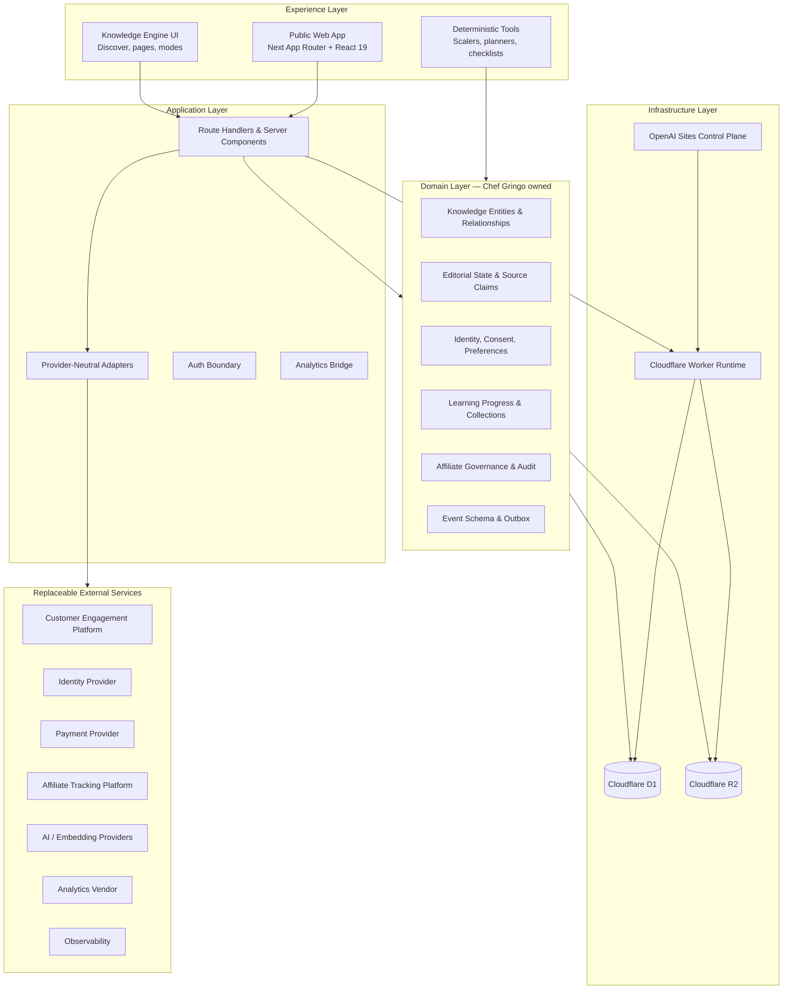
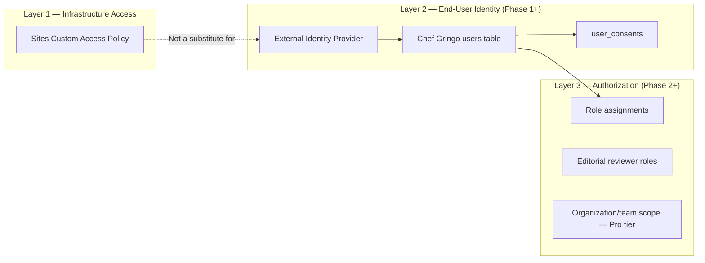
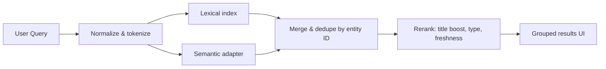
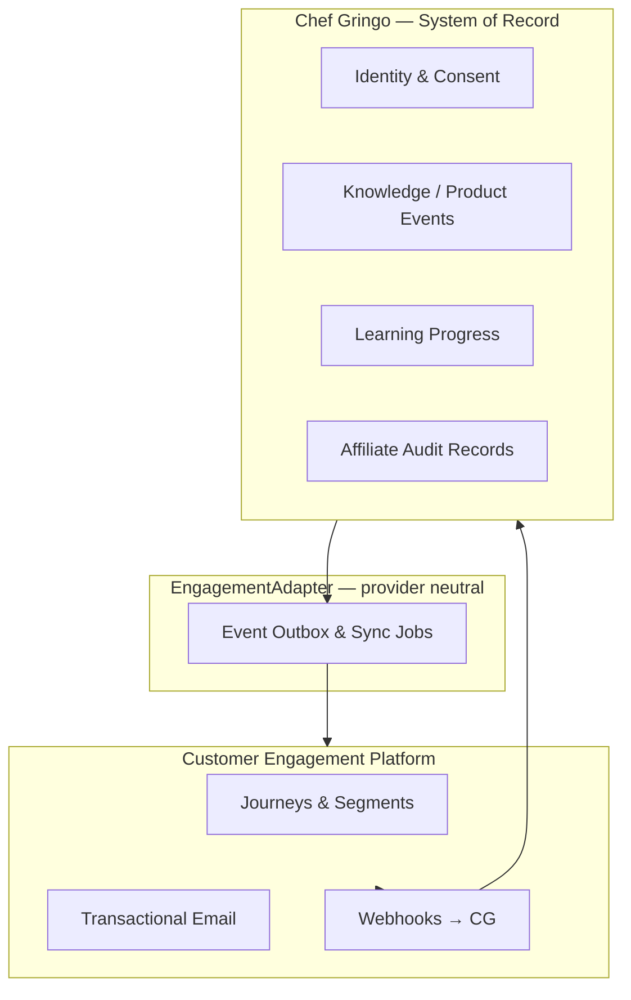
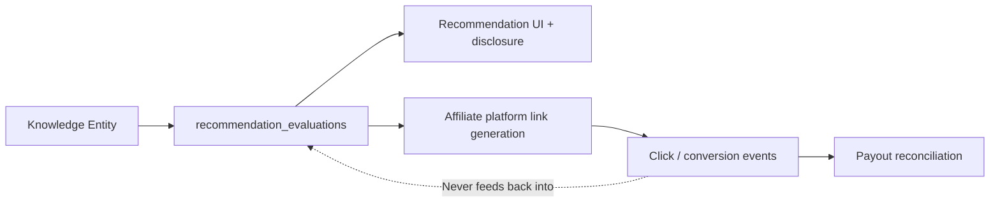
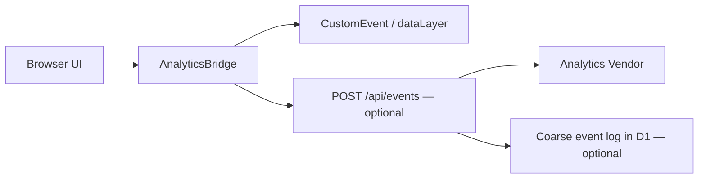
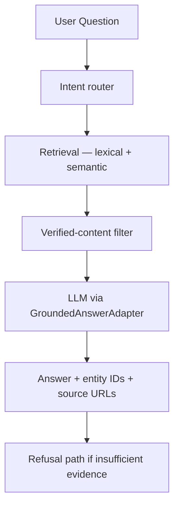
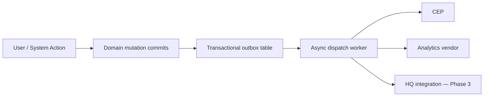

# Chef Gringo System Architecture

**Status:** Permanent technical blueprint  
**Author:** Chief Systems Architect, Aletheia  
**Last updated:** 2026-08-05  
**Repository:** [chef-gringo-platform](https://github.com/jjflash0777-creator/chef-gringo-platform)  
**Branch at authorship:** `codex/chef-gringo-foundation-sprint-01`

> This document defines how Chef Gringo is built, hosted, integrated, and scaled for the next five years. It is architecture and governance — not an implementation spec. For operational detail, see [`ENGINEERING_HANDOFF.md`](ENGINEERING_HANDOFF.md). For product constraints, see [`docs/foundation/`](foundation/).

---

## Architectural Constitution

These principles govern every technical decision. They align with Aletheia headquarters ([`VISION.md`](../../../00-Company/VISION.md), [`AI_RULES.md`](../../../00-Company/AI_RULES.md), [`DECISIONS.md`](../../../00-Company/DECISIONS.md)) and the Chef Gringo Constitution.

| Principle | Requirement |
|-----------|-------------|
| **Chef Gringo is the system of record** | Identity, consent, knowledge editorial state, learning progress, affiliate governance, and audit trails live in Chef Gringo-owned storage — never delegated to a vendor as authoritative truth. |
| **Every external provider is replaceable** | Provider SDKs and credentials stop at adapter boundaries. Domain types, entity IDs, and business rules never import vendor shapes. |
| **Never duplicate ownership of data** | Each datum has exactly one authoritative owner. Engagement platforms mirror; they do not own progress, certifications, or editorial verdicts. |
| **Infrastructure before expansion** | Durable foundations (CI, consent, editorial workflow, event schema) precede accounts, AI, affiliate commerce, payments, and marketplace. |
| **Trust is architectural** | Honest unavailable states, verification metadata, source-to-claim linkage, and disclosure separation are first-class data — not UI decoration. |
| **Deterministic before generative** | Recipe scaling, cost math, and compliance checks remain deterministic. AI explains and retrieves; it does not replace arithmetic or professional judgment. |

---

## 1. Overall System Architecture

Chef Gringo is a **trust-governed hospitality education platform** composed of a public web application, a versioned knowledge graph, deterministic tool engines, and progressively activated integration adapters — all deployed on a Cloudflare-compatible runtime packaged through OpenAI Sites.

### Logical layers



### Current state vs. target state

| Capability | Foundation Sprint 01 (now) | Target (5-year) |
|------------|---------------------------|-----------------|
| Public platform | Shipped | Mature multi-audience surfaces |
| Knowledge Engine | In-memory prototype (Carbonara) | Versioned repository + hybrid search |
| Persistence | None (D1/R2 dormant) | D1 primary; PostgreSQL if measured need |
| Identity | None (Sites access policy only) | Portable identity with consent ledger |
| Email | HTTP adapter, unconfigured | Event-driven CEP behind adapter |
| Analytics | Browser bridge only | Privacy-safe vendor + server collector |
| AI | Curated local Q&A | Retrieval-grounded, cited assistance |
| Payments | Architecture docs only | Provider-orchestrated, tokenized |
| Affiliate | Ethics + schema only | Governed recommendations + tracking platform |

### Deployment unit

One **Chef Gringo application** ships as a Cloudflare Worker bundle produced by `vinext build`. There is no separate BFF, no microservice mesh at MVP, and no monorepo coupling to other Aletheia products. Cross-product integration occurs through documented APIs and shared HQ patterns — not shared runtime.

---

## 2. External Services Inventory

Every external service is **optional behind an adapter** unless marked required for a specific phase.

### Hosting and runtime (required)

| Service | Role | Replaceability |
|---------|------|----------------|
| **OpenAI Sites** | Build packaging, version save, deploy, environment variables, project access policy | Migration requires alternate Cloudflare Worker deploy path (Wrangler direct, etc.) |
| **Cloudflare** | Worker runtime, D1, R2, image optimization, edge delivery | Core platform; migration is a major decision |
| **GitHub** | Source control, CI (planned), release coordination | Standard git remote; replaceable |

### Engagement and communications (Phase 0–2)

| Service | Role | Phase | Replaceability |
|---------|------|-------|----------------|
| **Loops** or **Brevo** | Near-term waitlist/newsletter bridge via HTTP adapter | 0–1 | Fully replaceable; adapter normalizes payload |
| **Customer.io** | Long-term Customer Engagement Platform (CEP): journeys, transactional email, SMS/push later | 1+ | Replaceable via `EngagementAdapter`; not system of record |

### Identity (Phase 1+)

| Service | Role | Replaceability |
|---------|------|----------------|
| **Portable OIDC provider** (e.g. Clerk, Auth0, WorkOS — decision pending) | End-user authentication outside Sites-only scope | `IdentityAdapter`; Chef Gringo stores `external_subject` mapping |
| **OpenAI Sites / ChatGPT headers** | Hosting-layer identity for Sites-native experiences | Optional; dormant in `chatgpt-auth.ts` |

### Data and search (Phase 1+)

| Service | Role | Replaceability |
|---------|------|----------------|
| **Cloudflare D1** | Primary relational store (SQLite) | `KnowledgeRepository` + Drizzle; migrate to PostgreSQL if measured |
| **Cloudflare R2** | Object storage (images, exports, attachments) | S3-compatible adapter |
| **Embedding provider** (OpenAI, Cloudflare Workers AI, etc.) | Vector generation for semantic search | `SemanticSearchAdapter` |
| **Managed search** (optional, Phase 3+) | Algolia, Typesense, or self-hosted index | `SearchIndexAdapter` |

### AI (Phase 2+)

| Service | Role | Replaceability |
|---------|------|----------------|
| **LLM provider** (OpenAI, Anthropic, etc.) | Grounded answers, summarization, admin assist | `GroundedAnswerAdapter` |
| **HQ / Odysseus** (Phase 3+, Aletheia) | Shared executive/agent patterns — reference only until HQ resumes | Integration boundary TBD |

### Commerce and affiliate (Phase 2–4)

| Service | Role | Replaceability |
|---------|------|----------------|
| **Stripe** (or equivalent) | Payments, subscriptions, Connect for marketplace | `PaymentAdapter`; no raw card data in Chef Gringo |
| **Affiliate platform** (Rewardful, PartnerStack, Tapfiliate, or custom) | Link tracking, partner onboarding, payouts | Separate from editorial ranking; Chef Gringo owns evaluation records |

### Analytics and observability (Phase 0–1)

| Service | Role | Replaceability |
|---------|------|----------------|
| **Privacy-appropriate analytics** (Plausible, Fathom, PostHog self-hosted, etc.) | Product analytics with coarse events | `AnalyticsVendorAdapter` |
| **Error monitoring** (Sentry, etc.) | Runtime errors, performance | Standard SDK at Worker boundary |
| **Uptime monitoring** (external ping) | Availability checks | Replaceable |

### Explicitly not selected as long-term anchors

Kit, Beehiiv, Mailchimp, Klaviyo — newsletter/media or ecommerce-centric platforms that conflict with governed education OS requirements. See [Email Architecture](#10-email-architecture).

### Vendor dependency (Aletheia portfolio, not Chef Gringo runtime)

| Service | Role |
|---------|------|
| **Odysseus** | Third-party self-hosted AI workspace; HQ integration reference when Phase 3 Platform resumes |

---

## 3. Hosting Architecture

### Production topology

```
Developer → GitHub (canonical source)
                ↓
         npm run build (vinext + Vite + Cloudflare plugin)
                ↓
         dist/ (Worker bundle + .openai/hosting.json + drizzle/)
                ↓
         OpenAI Sites (save version → deploy)
                ↓
         Cloudflare Edge (Worker + ASSETS + optional D1/R2 bindings)
                ↓
         End users (browser)
```

### Environment model

| Environment | Purpose | Identification |
|-------------|---------|----------------|
| **Local** | Development (`npm run dev`) | Wrangler/Miniflare in `.wrangler/` |
| **Private preview** | Founder and engineering review | **Separate Sites project ID** — must be verified by opaque ID, not title |
| **Production** | Live user traffic | Tracked project: `chef-gringo-mvp` (`appgprj_6a66280686748191931a0ed1cbde7a20`) |

**Safety rule:** The tracked production Sites project has a live deployment. Never deploy feature branches to production without explicit founder authorization. Preview and production project IDs must be documented in operations runbooks — never inferred from names or placeholders.

### Build pipeline (target)

| Stage | Tool | Output |
|-------|------|--------|
| Lint | ESLint (Next presets) | Pass/fail |
| Typecheck | TypeScript strict | Pass/fail |
| Build | `vinext build` | `dist/server/index.js` |
| Test | Node test suite + rendered Worker tests | 15+ tests (expand over time) |
| Deploy | Authorized Sites promotion | Versioned deployment |

CI/CD via GitHub Actions is **planned and required** before merge-heavy work. Deployment remains a separately authorized promotion — not automatic on every push.

### Secrets management

| Location | Contents |
|----------|----------|
| Local `.env*` | Developer secrets (gitignored) |
| OpenAI Sites environment | Production/preview runtime secrets |
| Repository | **Empty variable names only** in `.env.example` |

Never commit bearer tokens, API keys, or environment values to Git, logs, or documentation.

### Rollback

Preferred: redeploy last known-good Sites saved version for the same project. Source rollback via revert commit — never rewrite shared branch history.

---

## 4. Cloudflare Architecture

Cloudflare is the **primary runtime and data plane** for Chef Gringo.

### Components

| Component | Status | Purpose |
|-----------|--------|---------|
| **Workers** | Active | Serves App Router via `worker/index.ts`; image optimization at `/_vinext/image` |
| **D1** | Dormant (`d1: null`) | Intended primary relational database (SQLite at edge) |
| **R2** | Dormant (`r2: null`) | Intended object storage for media, exports, backups |
| **Assets** | Active | Static files from build (`ASSETS` binding) |
| **Images** | Active | Worker image transform pipeline |

### Worker responsibilities

1. Route all App Router requests through vinext handler.
2. Proxy image optimization with allowed width allowlist.
3. Expose D1 (`DB`) and R2 bindings when activated — no direct binding access from client code.
4. Enforce server-side validation on all mutating API routes.

### D1 strategy

- **ORM:** Drizzle with migrations packaged into `dist/.openai/drizzle/`.
- **When to activate:** First durable user data (early-access contacts + consent ledger, or first account).
- **Schema approach:** Bounded contexts introduced incrementally — never deploy full schema at once.
- **Exit criteria for PostgreSQL:** Complex reporting, heavy write concurrency, full-text search at scale, or multi-region write requirements — **only when measured**, not preemptively.

### R2 strategy

- User-uploaded content (Phase 4+ community).
- Editorial media with rights metadata.
- Export bundles for GDPR deletion/portability.
- Backup snapshots (encrypted).

### Local development

Cloudflare Vite plugin and vinext run locally. Wrangler state lives in gitignored `.wrangler/`. Node `>=22.13.0` required.

---

## 5. OpenAI Sites Architecture

OpenAI Sites is the **deployment and environment control plane** — not the application database, not the identity system of record, and not the editorial CMS.

### Integration points

| Concern | Sites role | Chef Gringo role |
|---------|------------|------------------|
| Build packaging | Receives `dist/` with `.openai/hosting.json` | `build/sites-vite-plugin.ts` copies hosting metadata |
| Versioning | Saved versions, deploy history | Git commit is source; Sites version is deploy artifact |
| Environment variables | Injects runtime secrets | Application reads standard env names |
| Access policy | Custom/private site access (founder gate) | Distinct from end-user product authentication |
| D1/R2 bindings | Declared in `hosting.json` | Application accesses via Worker `env` |

### Configuration (`/.openai/hosting.json`)

```json
{
  "project_id": "<opaque Sites project ID>",
  "d1": null,
  "r2": null
}
```

Bindings activate only when schema and operations readiness exist. Binding changes require migration plan and backup.

### Sites vs. product authentication

Sites custom access controls **who can reach the deployment URL** during private phases. End-user accounts — saved collections, progress, subscriptions — are a separate concern implemented in application layer with portable identity. The dormant `chatgpt-auth.ts` helpers read hosting-injected headers for Sites-native identity experiments; they must not become the sole identity model without an explicit architecture decision.

### Multi-project strategy

| Project | Purpose |
|---------|---------|
| Production | Live traffic; changes require explicit authorization |
| Preview | Feature branch review; separate opaque project ID |

One-project-with-promotion is acceptable only if version promotion is documented and reversible. Separate project IDs are recommended for the current team size.

---

## 6. Authentication

### Design goals

1. **Portable identity** — users exist beyond a single hosting vendor.
2. **Consent-aware** — authentication pairs with consent ledger entries.
3. **Least privilege** — role-based access for editorial, admin, and vendor surfaces.
4. **Honest scope** — no accounts until saved state or personalization is validated.

### Authentication layers



### Phase plan

| Phase | Capability |
|-------|------------|
| **0 (now)** | Public anonymous access; Sites access policy for deployment gate |
| **1** | Passwordless or OIDC login; `users` + `user_consents` in D1; session in httpOnly cookie |
| **2** | Saved collections, learning progress tied to `user_id` |
| **3** | Organization accounts for Chef Gringo Pro; team assignments |
| **4** | Vendor portal for marketplace (separate auth scope, KYC-gated) |

### Session model

- Server-validated sessions; no sensitive claims in client storage.
- Session revocation on consent withdrawal where legally required.
- Account deletion exports and soft-deletes with audit retention per policy.

### Identity provider selection (decision pending)

Evaluate when accounts ship: Clerk, Auth0, WorkOS, or native passwordless email. Criteria: GDPR tooling, webhook reliability, Chef Gringo adapter simplicity, cost at 100K–1M users, and no vendor lock-in of user progress data.

**Rejected as sole identity model:** Sites/ChatGPT headers only — insufficient for portable hospitality education ecosystem.

---

## 7. Database Ownership

Chef Gringo D1 (or future PostgreSQL) is the **authoritative store** for all trust-critical and product-critical data.

### Ownership matrix

| Data domain | System of record | Mirrors / derivatives | Never authoritative in |
|-------------|-------------------|----------------------|------------------------|
| User identity & profile | Chef Gringo `users` | CEP profile attributes (synced) | Email platform |
| Consent & preferences | Chef Gringo `user_consents` | CEP subscription status | ESP unsub alone |
| Early-access contacts | Chef Gringo `early_access_contacts` | CEP list membership | Webhook-only storage |
| Knowledge entities | Chef Gringo `knowledge_entities` + revisions | Search index, embeddings | CMS vendor |
| Editorial verdicts | Chef Gringo `editorial_reviews`, `entity_source_claims` | — | Any external tool |
| Learning progress | Chef Gringo `user_learning_progress` | CEP journey triggers | Email automation |
| Collections | Chef Gringo `collections`, `collection_items` | — | Browser localStorage |
| Affiliate evaluations | Chef Gringo `recommendation_evaluations`, `affiliate_relationships` | Affiliate platform click data | ESP segments |
| Orders & payments | Chef Gringo order snapshots + provider refs | Stripe (payment truth for money movement) | Stripe as editorial owner |
| Analytics events | Chef Gringo coarse event log (optional) + vendor | Vendor dashboards | Vendor as product state |
| Static assets | R2 + metadata in D1 | CDN cache | — |

### Schema evolution principles

1. **Bounded contexts** — activate tables only when the feature ships.
2. **Stable string IDs** — knowledge entities use `entity_type:slug` (e.g. `dish:carbonara`) permanently.
3. **Immutable revisions** — published content revisions are auditable; corrections append, not silent overwrite.
4. **Source-to-claim linkage** — sources support specific claims, not decorative link lists.
5. **Analytics separation** — high-volume analytics do not land in primary OLTP unless operational need is defined.

### First activation order

1. `early_access_contacts`, `user_consents` (or external provider + sync job with Chef Gringo copy).
2. Knowledge metadata tables when editorial workflow moves off Git-only.
3. `users` when accounts launch.
4. Commerce tables only after legal/tax/security gates.

Full proposed schema: [`ENGINEERING_HANDOFF.md` §10](ENGINEERING_HANDOFF.md).

---

## 8. Search Architecture

Search serves **discovery over the knowledge graph** — not speculative Q&A.

### Phase architecture



| Phase | Implementation | Status |
|-------|----------------|--------|
| **1** | `CuratedLocalSearchAdapter` — in-memory substring + intent map | **Shipped (prototype)** |
| **2** | Repository-backed lexical index (D1 or search engine) | Planned |
| **3** | `SemanticSearchAdapter` — embeddings + vector retrieval | Planned |
| **4** | Hybrid merge, dedupe by stable entity ID, evaluation harness | Planned |
| **5** | `GroundedAnswerAdapter` — answers require entity IDs + source URLs | Planned |

### Search rules

- **Honest empty states** — unknown queries return no result, not fabricated answers.
- **Provider neutrality** — embeddings and index live behind adapters; no SDK types in domain entities.
- **Privacy** — raw search queries are not transmitted to analytics vendors by default; use coarse categories and selected entity IDs.
- **Affiliate isolation** — search ranking inputs never include commission rate or commercial status.

### Index ownership

| Index type | Owner | Refresh trigger |
|------------|-------|-----------------|
| Lexical | Chef Gringo search service | Entity publish/revise webhook |
| Vector | Chef Gringo embedding pipeline | Same + batch rebuild job |
| External managed index | Adapter sync job | Event-driven from repository |

Client-bundle search (current) is acceptable only for prototype corpus size. Production search must be server-side or edge-indexed before corpus exceeds ~100 entities.

---

## 9. Knowledge Engine Architecture

The Hospitality Knowledge Engine is Chef Gringo's **core product differentiator** — a typed graph of hospitality knowledge with explicit trust metadata.

### Entity model

**Implemented types:** Dish, Recipe, Ingredient, Technique, Cuisine, Chef Interpretation, Equipment, Dietary Consideration.

**Reserved types:** Restaurant, Nutrition Topic, Supplier, Learning Path, Hospitality Role, Workflow.

Every entity carries: stable ID, slug, type, title, summary, status, verification state, tags, timestamps, sources, optional reviewer metadata, relationships.

### Relationship model

First-class directed edges: `uses_ingredient`, `requires_technique`, `belongs_to_cuisine`, `has_dietary_consideration`, `interpretation_of`, `supports_technique`, plus reserved types for substitutions, learning paths, suppliers, roles, workflows.

### Layer boundaries

```
┌─────────────────────────────────────────────┐
│  UI (KnowledgeSearch, KnowledgePage)        │
├─────────────────────────────────────────────┤
│  Adapters (KnowledgeRepository, Search, AI) │
├─────────────────────────────────────────────┤
│  Domain (types, seed/repository, recipe.ts) │
└─────────────────────────────────────────────┘
         ↑ No provider SDK crosses this line
```

### Content storage evolution

| Stage | Storage | When |
|-------|---------|------|
| Prototype | TypeScript seed (`domain/seed.ts`) | Now |
| Editorial v1 | Versioned Git/MDX + validation CI | Sprint 02–03 |
| Editorial v2 | D1 revisions + Git mirror for audit | Multiple editors |
| CMS (optional) | Headless CMS as **authoring export**, not system of record | Only if workflow demands |

Chef Gringo revision tables remain authoritative even if a CMS is used for drafting.

### Trust properties (non-negotiable)

- Verification states: `seeded` → `source-ready` → `reviewed` → `verified`.
- Content lifecycle: `draft` → `review` → `published`.
- Missing evidence remains visible — absence is not converted to certainty.
- Third-party chef content: attributed summaries in original language, not reproduction.
- Nutrition, allergens, clinical-adjacent domains require qualified review before `verified`.

### Deterministic tools

Recipe scaling, shopping lists, and operator calculators live in domain layer (`domain/recipe.ts`, legacy `scaler.mjs`). AI may explain outputs; it does not perform core arithmetic.

### Future integrations (adapter-only)

`CommerceAdapter`, `PlaceDiscoveryAdapter`, `NutritionAdapter`, `AccountCollectionsAdapter`, `CommunityContributionAdapter` — defined in `app/knowledge/integrations/contracts.ts`; inactive in Phase 1.

---

## 10. Email Architecture

Derived from the [Email & CRM Architecture Review](Email & CRM Architecture Review) (2026-08-05 session) and engineering handoff.

### Architectural stance

Email and lifecycle messaging are **downstream of Chef Gringo events** — not a parallel CRM or contact database of record.



### Platform selection

| Horizon | Platform | Role |
|---------|----------|------|
| **Phase 0 (0–12 mo)** | **Loops** (preferred) or **Brevo** (budget) | Waitlist/newsletter via existing `/api/early-access` HTTP adapter |
| **Phase 1+ (12 mo+)** | **Customer.io** | Event-driven CEP: journeys, transactional, SMS/push later, MCP for agents |
| **Phase 3+ (optional)** | **HubSpot Starter** | B2B institution/vendor deals only — not lifecycle engine |

**Avoid as long-term core:** Kit, Beehiiv, Mailchimp, Klaviyo.

### Current implementation

- `POST /api/early-access` and legacy `POST /api/subscribe` forward normalized JSON to configurable HTTPS endpoint.
- No email SDK in application code.
- Honeypot abuse control; no rate limiting yet.
- Returns honest `503` when endpoint unconfigured.
- Sites project has **zero** runtime environment variables as of 2026-08-05.

### Event schema (target)

Emit to CEP from Chef Gringo — never invent audience state inside ESP:

| Event | Trigger |
|-------|---------|
| `early_access_submitted` | Waitlist form success |
| `account_created` | First login |
| `entity_viewed` | Knowledge page view (entity ID, mode) |
| `path_enrolled` / `lesson_completed` | Academy progress |
| `cert_issued` / `cert_expiring` | Certification lifecycle |
| `consent_updated` | Preference change |

Attributes synced: `role`, `interest`, `pathway`, `consent_marketing`, `consent_analytics`, `guidance_mode_preference`.

### Consent and compliance

- Consent records in Chef Gringo `user_consents` with policy version.
- Double opt-in: product decision before provider connect.
- Export/deletion procedures before durable storage.
- Senior-living segments may require HIPAA-capable CEP tier (Customer.io supports; Loops does not).
- Affiliate segmentation must **never** use commission data as rank input.

### Consolidation debt

Merge `/api/early-access` and `/api/subscribe` into one **Subscription Domain Service** with list/source metadata — single form, single validation, single consent path.

---

## 11. Affiliate Architecture

Affiliate commerce funds the platform; it **never purchases editorial trust**.

### Governance model

| Layer | Owner | Responsibility |
|-------|-------|----------------|
| Editorial evaluation | Chef Gringo | Fit, quality, reliability, total cost, operational context |
| Commercial relationship | Chef Gringo `affiliate_relationships` | Disclosure, contract terms, audit trail |
| Click/conversion tracking | Affiliate platform (Phase 3+) | Links, attribution windows, payouts |
| User-facing presentation | Chef Gringo UI | Disclosure near recommendation; sponsored visually distinct |

### Rules (from Affiliate Ethics)

1. Commission size does not influence rank or inclusion.
2. Material relationships disclosed adjacent to recommendation.
3. Sponsored placement distinct from editorial evaluation.
4. Vendors cannot suppress independent conclusions.
5. Products may be omitted or criticized despite commercial relationship.
6. Ranking logic changes require editorial review and auditable record.

### Architecture



No email platform, analytics vendor, or AI model participates in ranking decisions.

### Phase plan

| Phase | Capability |
|-------|------------|
| 0 | Ethics docs + schema placeholders only (**now**) |
| 1 | Manual disclosed links in content; spreadsheet audit |
| 2 | Single-category pilot with affiliate platform + Chef Gringo evaluation records |
| 3 | Multi-category with ranking governance UI |
| 4 | Marketplace eligibility separate from editorial endorsement |

---

## 12. Analytics Architecture

### Current state

`trackEvent(name, details)` in browser:

- Pushes to `window.dataLayer` if present.
- Dispatches `chefgringo:analytics` CustomEvent.
- No vendor, no server collector, no schema registry.

### Target architecture



### Event schema principles

1. **Typed event catalog** — snake_case names; versioned payload shapes.
2. **Data minimization** — no raw search queries, PII, or free-form user text to vendors by default.
3. **Coarse alternatives** — result counts, entity IDs, query categories.
4. **Consent gating** — `consent_analytics` before third-party transmission.
5. **Separation** — analytics DB ≠ product OLTP unless operational need defined.

### Priority events (existing)

Landing views, CTA selections, waitlist states, knowledge search/submit/select, guidance mode changes, serving/scaling, shopping list generation, troubleshooting, curated questions.

### Vendor selection criteria

Privacy-respecting defaults, EU compliance, no data sale, adapter replaceability, reasonable cost at 1M MAU. Evaluate Plausible, Fathom, PostHog (self-hosted), or similar — decision pending privacy review.

---

## 13. AI Architecture

AI **augments** hospitality education; it does not replace judgment, deterministic tools, or editorial process.

### Bounded capabilities

| Capability | Allowed | Forbidden |
|------------|---------|-----------|
| Retrieve reviewed content | Yes, with citations | Answering from unreviewed corpus |
| Explain deterministic tool output | Yes | Performing core recipe math via LLM |
| Summarize for mode (beginner/pro) | Yes, from approved blocks | Fabricating historical certainty |
| Personalization | Explicit preferences only | Inferring medical/dietary needs |
| Agent operations | Trigger approved CEP journeys via API | Inventing user records |

### Architecture



### Phase plan

| Phase | Capability |
|-------|------------|
| 0 | Curated local Q&A on knowledge pages (**now**) |
| 1 | Repository-backed retrieval; no generative answers |
| 2 | Grounded answers with mandatory citations and refusal |
| 3 | Admin/editorial assist (draft summaries — human review required) |
| 4 | HQ-shared agent patterns (Aletheia Phase 3) |

### Provider neutrality

`GroundedAnswerAdapter`, `SemanticSearchAdapter` — no OpenAI/Anthropic types in `domain/types.ts`. API keys server-side only. Log prompts/responses with retention limits and PII redaction.

### Evaluation harness (required before generative launch)

Retrieval quality, citation coverage, abstention rate, freshness, mode appropriateness, and regression tests on refusal behavior.

---

## 14. Payments Architecture

Payments are **orchestrated, not owned** — Chef Gringo never stores card numbers or wallet credentials.

### Principles (from Payment Architecture)

- Regulated provider handles tokenization (Stripe or equivalent).
- `PaymentAdapter` normalizes intents, outcomes, refunds, disputes.
- Domain distinguishes fiat, stable crypto, volatile crypto; one-time vs. subscription; direct vs. marketplace.
- Marketplace uses Connect-style split payments — Chef Gringo does not custody seller funds.

### Core records (Chef Gringo owned)

Order snapshot, payment intent reference, transaction state, ledger entries, tax evidence, vendor payable, settlement batch, customer receipt.

### Decision gates (all required before implementation)

Legal entity review, tax design, product terms, privacy review, refund policy, chargeback ownership, provider comparison, accounting integration, security threat model, accessibility review, test-mode rehearsal.

### Phase plan

| Phase | Capability |
|-------|------------|
| 0 | None (**now**) |
| 1 | Individual subscription (Chef Gringo Pro) |
| 2 | One-time digital purchases (templates, curricula) |
| 3 | Marketplace with vendor onboarding, KYC, disputes |
| 4 | Institutional/team billing |

Monetization sequence recommendation: **audience value + one paid learning/tool proposition → governed affiliate → marketplace last**.

---

## 15. Security Model

### Threat assumptions

- Public internet-facing Worker; untrusted input on all API routes.
- Early-access forms are bot targets.
- Hosting credentials and API keys are high-value targets.
- Editorial content is a trust attack surface (poisoned sources, copied proprietary material).

### Controls

| Domain | Control |
|--------|---------|
| **Transport** | HTTPS only; HSTS via Cloudflare |
| **Input validation** | Client + server validation; honeypot on forms |
| **Abuse** | Rate limiting (planned), request size limits, timeout on provider fetch |
| **Auth** | httpOnly sessions; CSRF on mutating routes; open-redirect defenses in `chatgpt-auth.ts` |
| **Secrets** | Server-only env; never in client bundle or Git |
| **Webhooks** | Signature verification for payment and CEP webhooks |
| **Payments** | Server-side amount calculation; idempotency keys |
| **Admin** | Separate auth scope; least privilege; audit log |
| **Dependencies** | Lockfile committed; CI audit (planned) |
| **Deployment** | Verified project ID before mutate; rollback coordinates recorded |

### Security-sensitive dormant code

`app/chatgpt-auth.ts` — preserve open-redirect defenses even while unused.

### Incident response (target)

Error monitoring alerts → triage → rollback deploy if needed → post-incident note in headquarters `DAILY_LOG.md` and `DECISIONS.md` if architectural change required.

---

## 16. Privacy Model

### Data categories

| Category | Examples | Retention driver |
|----------|----------|------------------|
| Contact | Email, name, role, interest | Consent + early-access purpose |
| Behavioral (coarse) | Entity views, path progress | Product improvement; consent |
| Identity | Auth provider subject, profile | Account relationship |
| Payment | Provider customer ID — not PAN | Transaction law |
| Editorial | Author/reviewer IDs on content | Provenance audit |

### User rights (target)

- Access export (machine-readable).
- Deletion with defined exceptions (legal, financial records).
- Consent withdrawal stops marketing sync to CEP.
- Policy version tracked per consent grant.

### Analytics privacy

No raw search queries or makeover free-text to third parties without explicit decision. Landing-stage privacy policy is draft — legal review required before durable contact storage.

### Specialized domains

Senior living, healthcare dining, allergens, dysphagia — no confident personalized guidance without qualified review. HIPAA-grade handling if PHI-adjacent features ship.

---

## 17. Event Architecture

Events connect product behavior to engagement, analytics, and future HQ integration without coupling domains.

### Event bus pattern (target)



### Event categories

| Category | Examples | Consumers |
|----------|----------|-----------|
| **Product** | `entity_published`, `lesson_completed` | Internal workflows |
| **Engagement** | `early_access_submitted` | CEP |
| **Analytics** | `knowledge_search_submitted` (coarse) | Analytics vendor |
| **Commerce** | `order_captured`, `refund_issued` | Ledger, CEP, ops |
| **Governance** | `ranking_criteria_changed` | Audit log, editorial |

### Rules

1. Events are **facts after commit** — emit after database transaction succeeds.
2. Outbox enables retry without duplicating domain logic.
3. Schema registry with version numbers — breaking changes increment version.
4. PII minimization in event payloads; reference user by internal ID.

### Current state

Browser-only analytics events with no outbox, no server collector, no registry. Establish typed catalog before connecting vendors.

---

## 18. API Boundaries

### Public API surface (application)

| Endpoint | Method | Auth | Purpose |
|----------|--------|------|---------|
| `/api/early-access` | POST | Public | Waitlist adapter |
| `/api/subscribe` | POST | Public | Legacy newsletter adapter |
| `/api/events` | POST | Public/session | Server analytics collector (planned) |
| `/api/auth/*` | * | Public | Identity callbacks (planned) |
| `/api/webhooks/*` | POST | Signed | CEP, payments, affiliate (planned) |

### Internal boundaries (TypeScript modules)

| Boundary | Contract | Direction |
|----------|----------|-----------|
| UI → Domain | Domain functions and types | Inward only |
| Domain → Adapters | Interface definitions in `integrations/contracts.ts` | Domain defines; adapters implement |
| Adapters → External | HTTPS/SDK at adapter implementation | Never imported by domain |
| Worker → D1 | Drizzle via `getDb()` | Server only |

### Future external APIs (Chef Gringo as platform)

Phase 4+ optional read APIs for partners (institutions, approved vendors) — API keys, rate limits, separate from HTML app. Not planned before core product validation.

### HQ integration boundary (Aletheia Phase 3)

HQ provides shared executive/agent infrastructure. Chef Gringo exposes:

- Read-only product metrics feed (coarse).
- Event webhook subscription (opt-in).
- No direct HQ access to Chef Gringo database.

Chef Gringo never depends on HQ for runtime availability.

---

## 19. Future Aletheia Integrations

Chef Gringo is the **active Aletheia product** (Phase 1–2). Other portfolio systems integrate only when roadmap phases resume and explicit boundaries exist.

| Aletheia system | Phase | Integration pattern |
|-----------------|-------|---------------------|
| **HQ** (`01 - HQ/hq`) | Phase 3 Platform | Shared agent patterns, composition layer; Chef Gringo events feed executive dashboards; no runtime dependency |
| **Signal Forge** | Phase 4 Intelligence | Market research informs business decisions; no user-facing coupling |
| **Odysseus** | Vendor reference | HQ integration dependency; not Chef Gringo runtime |
| **The Unsealing / UEOS** | Phase 5 Experience | Independent products; shared HQ infra only |
| **Nasquatch** | Phase 5 | Asset library; no technical coupling |

### HQ compounding rules

1. Extract patterns from Chef Gringo only after they prove stable — not from prototypes.
2. Shared libraries live in HQ repository; Chef Gringo imports versioned packages — not copy-paste.
3. Each product maintains independent deploy, database, and identity.
4. Headquarters [`PROJECT_INDEX.md`](../../../00-Company/PROJECT_INDEX.md) remains organizational source of truth.

### Customer.io workspace strategy

Separate CEP workspaces per Aletheia product at scale; shared event schema conventions documented in HQ.

---

## 20. Scaling Plan: MVP → One Million Users

Scaling is **phased by measured need**, not premature optimization.

### Scale tiers

| Tier | Users (registered) | MAU estimate | Infrastructure posture |
|------|-------------------|--------------|------------------------|
| **MVP** | 0 – 5K | 1 – 10K | Single Worker, D1, dormant R2; Loops/Brevo; no accounts |
| **Growth** | 5K – 50K | 10K – 100K | D1 active; Customer.io; CI/CD; CDN cache; lexical search index |
| **Expansion** | 50K – 250K | 100K – 500K | Hybrid search; read replicas or PostgreSQL if D1 limits hit; R2 media; accounts at scale |
| **Platform** | 250K – 1M | 500K – 2M | Edge caching strategy; event outbox workers; connection pooling; observability SLOs |
| **Ecosystem** | 1M+ | 2M+ | Evaluate PostgreSQL primary, dedicated search cluster, multi-region, enterprise CEP |

### Dimension-specific scaling

| Dimension | MVP | 1M users |
|-----------|-----|----------|
| **Compute** | Single Worker bundle | Worker with optimized cold start; static asset aggressive cache |
| **Database** | D1 single region | D1 or PostgreSQL with read scaling; archival strategy for old revisions |
| **Search** | In-memory / D1 FTS | Managed search + vector index; evaluation CI |
| **Media** | `public/` static | R2 + CDN; image optimization at edge |
| **Email** | Bridge provider | Customer.io with workspace governance |
| **Events** | Browser-only | Outbox + async dispatch; dead-letter queue |
| **Team** | Founder + agents | Editorial ops, moderation, support tooling |

### Bottleneck watchlist

1. D1 write throughput on progress tracking — batch or shard by user.
2. Client-bundle knowledge corpus — move to server search before ~100 deep pages.
3. Global CSS monolith — modularize before route count doubles.
4. CEP cost at event volume — coarse events, attribute discipline.
5. Editorial throughput — graph architecture useless without content pipeline.

### What not to scale prematurely

- Microservices decomposition.
- Multi-region active-active.
- Kubernetes.
- Custom email delivery infrastructure.
- Marketplace payments before governance exists.

---

## 21. Build Sequence Summary

Aligned with [`ROADMAP.md`](foundation/ROADMAP.md) and Aletheia Phase 1–2.

| Gate | Deliverable | Depends on |
|------|-------------|------------|
| G0 | CI/CD, preview project, founder review | — |
| G1 | Durable early access + consent in D1 | G0, legal review |
| G2 | Editorial repository (Git/MDX + validation) | G1 |
| G3 | 3–5 knowledge pages in one cluster | G2 |
| G4 | Repository-backed search | G3 |
| G5 | Typed analytics + vendor | G1, privacy review |
| G6 | Accounts + collections | G3, user validation |
| G7 | Customer.io migration + event schema | G6 |
| G8 | Grounded AI (retrieval + citations) | G4, evaluation harness |
| G9 | Chef Gringo Pro subscription | G6, payment gates |
| G10 | Affiliate pilot (one category) | G3, affiliate platform |
| G11 | Marketplace | G9, G10, legal/ops |

**No gate may be skipped by labeling a preview as production.**

---

## 22. Document Governance

| Action | Update |
|--------|--------|
| New external provider adopted | This document + `DECISIONS.md` |
| Database ownership change | This document + `DECISIONS.md` + migration plan |
| Deployment model change | This document + `ENGINEERING_HANDOFF.md` |
| Major integration launch | Adapter contract in repo + this document |
| Phase completion | Aletheia `ROADMAP.md` + `PROJECT_INDEX.md` |

This document distinguishes **implemented**, **scaffolded**, **planned**, and **rejected** — matching the honesty standard of the product itself.

---

## Related Documents

| Document | Purpose |
|----------|---------|
| [`ENGINEERING_HANDOFF.md`](ENGINEERING_HANDOFF.md) | Operational handbook, current state, debt |
| [`foundation/CHEF_GRINGO_CONSTITUTION.md`](foundation/CHEF_GRINGO_CONSTITUTION.md) | Product non-negotiables |
| [`foundation/PRODUCT_ARCHITECTURE.md`](foundation/PRODUCT_ARCHITECTURE.md) | Future platform pillars |
| [`foundation/PAYMENT_ARCHITECTURE.md`](foundation/PAYMENT_ARCHITECTURE.md) | Payment orchestration |
| [`foundation/AFFILIATE_ETHICS.md`](foundation/AFFILIATE_ETHICS.md) | Commercial governance |
| [`knowledge-engine/KNOWLEDGE_ARCHITECTURE.md`](knowledge-engine/KNOWLEDGE_ARCHITECTURE.md) | Entity and relationship model |
| [`knowledge-engine/SEARCH_AND_DISCOVERY_ARCHITECTURE.md`](knowledge-engine/SEARCH_AND_DISCOVERY_ARCHITECTURE.md) | Search evolution |
| [`../../../00-Company/VISION.md`](../../../00-Company/VISION.md) | Aletheia constitution |
| [`../../../00-Company/ROADMAP.md`](../../../00-Company/ROADMAP.md) | Company phase sequencing |

---

*Permanent blueprint. Amend deliberately. Record significant changes in Aletheia [`DECISIONS.md`](../../../00-Company/DECISIONS.md).*
